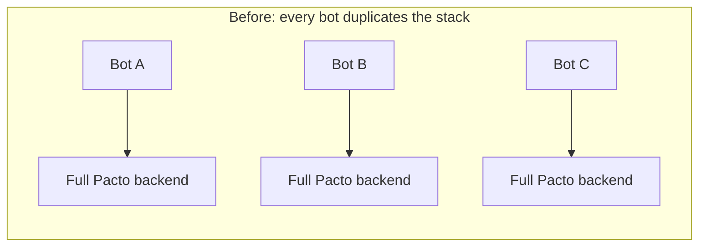
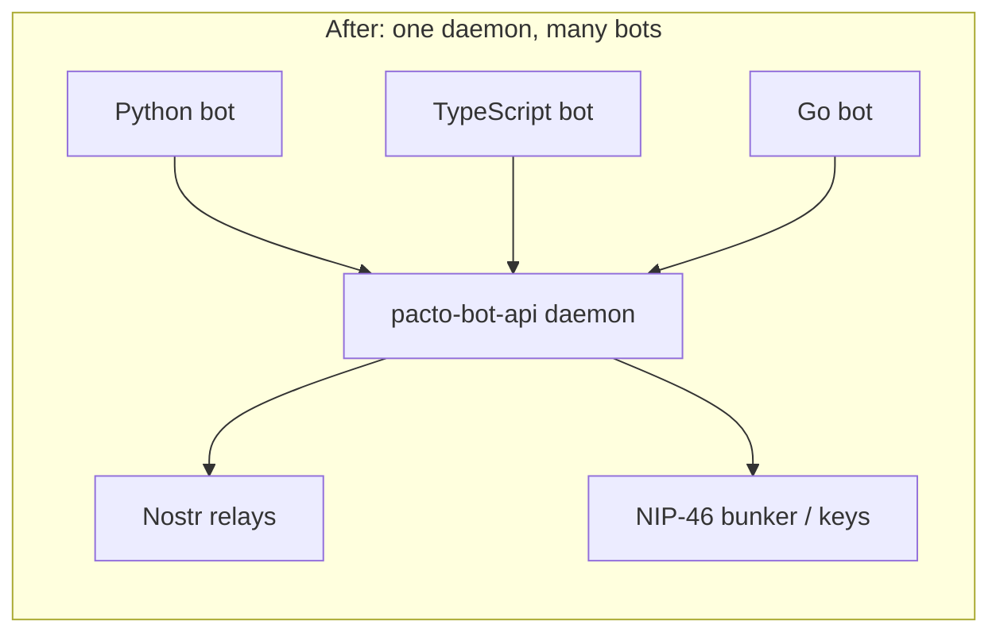
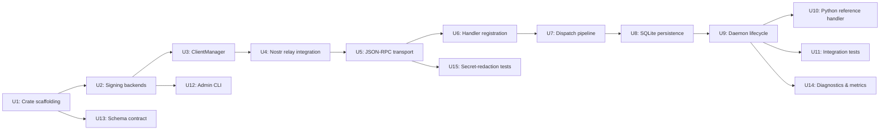

# Executive Summary: Pacto Bot API Daemon

**Plan reviewed:** `docs/plans/2026-06-24-001-feat-pacto-bot-api-daemon-plan.md`  
**Date:** 2026-06-24  
**Status:** Phase 1 planning

---

## TL;DR

Build **one standalone daemon** that runs multiple Pacto bots on a single shared backend. Bot developers connect to it over a simple language-agnostic API instead of embedding the entire Pacto stack in every bot. The daemon handles Nostr relays, encrypted DMs, signing keys, and message routing; the bot code only handles business logic.

---

## Problem this solves

Today, every Pacto bot would need its own copy of the full Pacto backend — Nostr client, encryption engine, blockchain RPC, database. Running 3 bots means 3 copies of the stack, roughly 600 MB to 1.2 GB of duplicated memory.

The daemon replaces that with **one shared backend** that all bots use. Bot code can be written in Python, TypeScript, Go, or any language, and connect to the daemon through a standard JSON-RPC socket.

---

| Component | Purpose |
|---|---|
| `pacto-bot-api` daemon | Long-running process that owns relay connections, encryption, signing, routing, and persistence |
| Unix socket API | Primary local interface for bot handlers (`$DATA_DIR/pacto-bot-api.sock`) |
| Localhost HTTP API | Optional interface on `127.0.0.1:9800`, disabled by default, protected by a secret token |
| `pacto-bot-admin` CLI | Tool to create bots, publish profiles, test bunkers, export/import bot state, and emit structured diagnostics |
| `schemas/` | Canonical JSON Schema/OpenRPC contract for config, JSON-RPC catalog, and metrics |
| Diagnostics & metrics | `agent.metrics` JSON-RPC, `pacto-bot-admin diagnose`, and `$DATA_DIR/reports/latest.json` for agentic feedback |
| Python example handler | Reference bot plus reusable pytest fixtures |
---

## How bot developers will use it

1. Create a bot identity with `pacto-bot-admin new <bot-name>`.
2. Register the keys with a NIP-46 bunker, or use a local test key for development.
3. Publish the bot profile with `pacto-bot-admin publish-profile`.
4. Add the bot entry to `pacto-bot-api.toml`.
5. Start the daemon.
6. Write a handler in any language that connects to the socket and registers for events.

The daemon pushes incoming DMs to the handler; the handler replies by sending a simple JSON-RPC notification back.

---

## Key capabilities in this phase (Phase 1)

- Multiple bot identities managed in one daemon.
- Encrypted DM send and receive over Nostr.
- Language-agnostic JSON-RPC 2.0 API.
- Handler registration with capability checks.
- SQLite persistence of event cursors and handler state.
- Graceful startup, shutdown, and restart recovery.
- Machine-readable schemas, deterministic in-process tests, structured diagnostics, and secret-redaction verification for agentic workflows.
- Three signing options ranked by security posture:
  - local test key (development only, warned in logs)
  - local NIP-46 bunker
  - remote NIP-46 bunker (production)

---

## What is intentionally not included

| Deferred | Phase |
|---|---|
| MLS group messaging | 2 |
| On-chain governance reads/writes | 2–3 |
| Webhook outbound delivery | 3 |
| Runtime add/remove of bots | 3 |
| TEE secure enclaves | 4 |
| Official Python/TypeScript/Go SDKs | 4 |
| Bot marketplace | 4 |

---

## Delivery breakdown

The work is split into 15 implementation units:

Units U1–U9 build the daemon itself. U10 provides a developer-friendly example. U11 adds end-to-end tests. U12 adds the admin tool. U13–U15 define the agentic verification layer: schema-first contracts, structured diagnostics/metrics/dev-env compatibility, and secret-redaction tests.
---

## Main risks

| Risk | Mitigation |
|---|---|
| NIP-46 bunker unavailable or flaky | Retry with backoff; document bunker as prerequisite |
| Relay rate limits | Relay pool with reconnect logic |
| SQLite corruption on crash | WAL mode, periodic cursor flush, backup guidance |
| `nostr-sdk` breaking changes | Pin exact version, monitor releases |

---

## Success criteria

- Daemon starts from a TOML config and accepts handler connections over a Unix socket.
- A Python example handler can register, receive a DM, and send a reply.
- Cursors and handler state survive a daemon restart.
- Integration tests pass against in-process mock relay/bunker and, optionally, the `pacto-dev-env` Docker environment.
- Admin CLI can create, export, import, and verify bot identities.
- `cargo test` includes schema-sync checks, secret-redaction tests, and requirement-coverage checks; `agent.metrics` and `pacto-bot-admin diagnose --format json` produce machine-parseable output.
- Graceful shutdown persists cursors and releases the lock; restart recovers from the last cursor without duplicate delivery under the cursor-advance rule.
- Per-handler and per-bot aggregate rate limits return `-32005` when exceeded.
- Slow or disconnected handlers cannot block dispatch to other handlers.
- Every requirement R1–R37 has at least one covering test or documented exclusion.
