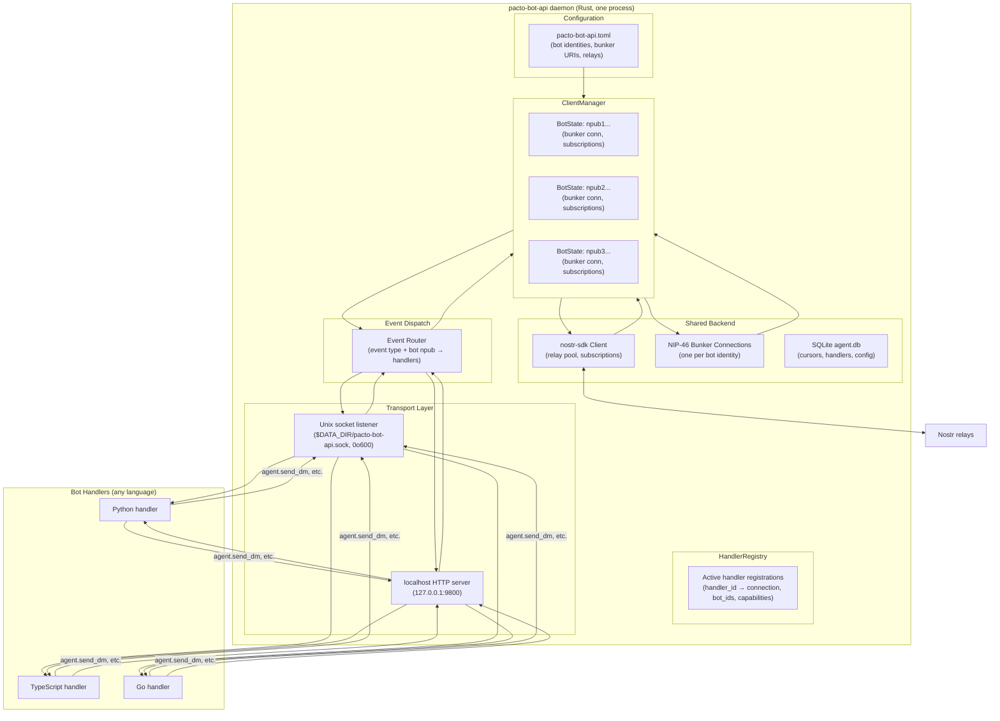

## Summary

Build `pacto-bot-api` — a standalone Rust daemon that multiplexes multiple Pacto bot identities onto a single shared backend (nostr-sdk, MDK MLS engine, alloy RPC, SQLite) and exposes a language-agnostic JSON-RPC 2.0 API over Unix socket and localhost HTTP. Bot developers write handlers in any language; the daemon owns all heavy infrastructure.

## Problem Frame

Pacto has no bot API. The three bot shapes identified in the architecture research (in-process plugin, local sidecar, remote NIP-46 bunker) all require each bot to duplicate the entire Pacto backend — nostr-sdk Client, MDK MLS engine, alloy RPC connections, SQLite database. Three bots = three copies of the stack (~600–1,200 MB). The core-modified approach eliminates duplication but locks handlers into Pacto's process lifecycle and Rust/FFI.

The daemon-first approach (architecture doc §7.9) solves both: one copy of the backend amortized over all bots, language-agnostic handlers over JSON-RPC, independent lifecycle, zero core changes to Pacto. This is the Telegram `telegram-bot-api` model adapted for decentralization — each bot operator runs their own daemon.

## Requirements

### API surface

- R1. The daemon exposes a JSON-RPC 2.0 API over a Unix domain socket (`$PACT_DATA_DIR/pacto-bot-api.sock`) with `0o600` permissions. Unix socket authentication is kernel file-permission only; handler identity is not cryptographically verified in Phase 1.
- R2. The daemon exposes the same JSON-RPC 2.0 API over localhost HTTP (`127.0.0.1:9800`), bound to loopback only. The HTTP transport requires an `X-Pacto-Bot-Secret` header on every request. The secret is generated on first run with a CSPRNG (32-byte / 256-bit hex), stored at `$DATA_DIR/bot_secret_token` with `0o600` permissions, and must never be logged or returned in error responses. The token can be rotated via `pacto-bot-admin rotate-http-token`; rotation is a hard cutover (old token invalid immediately). The HTTP transport is disabled by default; enable with `--enable-http`.
- R3. The API uses newline-delimited JSON frames (one JSON-RPC message per line, `\n` terminated). No length prefix. Maximum frame size is 1 MB; connections sending larger frames are dropped. The transport layer enforces a maximum number of concurrent connections and an idle timeout.
- R4. The API supports the full method catalog defined in the architecture doc §7.7.4, adapted for daemon→handler direction (see High-Level Technical Design).

### Bot identity and key management

- R5. The daemon manages multiple bot identities via a `ClientManager`. Each bot is a separate Nostr identity with its own npub, MLS device leaf, and capability set. The `ClientManager` maintains a bidirectional `bot_id` ↔ `npub` mapping for routing. In Phase 1, bot identities are loaded from static config; runtime registration, removal, or pausing of bot identities is deferred to Phase 3.
- R6. The daemon supports three signing backends per bot identity: (a) **local test key** — nsec hex in config or `PACT_BOT_NSEC` env var, for early iteration; (b) **local NIP-46 bunker** — a bunker on the same machine, to prove the remote-signing path; (c) **production NIP-46 bunker** — a remote bunker. The daemon logs a warning when a local test key is in use. For bunker backends, the daemon verifies the bunker's pubkey matches the configured npub at connection time and fails hard on mismatch. The `nsec` backend uses `zeroize` to clear key material from memory on drop. Production bunker URIs must use `wss://` (not `ws://`). The daemon must not log the nsec, bunker URI, HTTP secret token, or any derived signing material.
- R7. Bot identities are configured via a TOML config file (`pacto-bot-api.toml`) listing each bot's npub, signing backend (one of `nsec`, `bunker_local`, `bunker_remote`), relay list, and capabilities. `bot_id` values must be unique within the config; duplicate `bot_id` is a validation error. The daemon refuses to start if the config file is readable by group or other (must be `0o600` or more restrictive).
- R8. A `bot_id` is a daemon-local label for a configured bot identity. The daemon maintains a bidirectional `bot_id` ↔ `npub` mapping, and duplicate `bot_id` values within a single config are a validation error.
- R9. Bot identities are created and deleted only through the `pacto-bot-admin` CLI; the daemon runtime never creates or deletes identities.

### Bot lifecycle: creation, identification, and reuse

- R10. Bot state (event cursors, handler registrations, capability grants) is exportable as a JSON file via `pacto-bot-admin export <bot_id>`. A bot can be moved to a new daemon instance by copying the config entry and importing the state file via `pacto-bot-admin import <bot_id> <state.json>`. The nsec stays with the bunker; only daemon-local state travels. Export files include metadata (daemon version, export timestamp, source data_dir) and a warning that running two daemons with the same bot identity causes duplicate replies. The admin CLI refuses to operate if the daemon is running (detected via lock file).
- R11. The daemon never creates or deletes bot identities. It only manages bots that already exist in its config file. Bot creation and deletion are admin operations, not runtime operations.

### Messaging

- R12. The daemon sends and receives NIP-17/44/59 DMs (gift wrap pipeline) for each registered bot identity.
- R13. The daemon subscribes to `kind:1059` gift wraps `#p`-tagged to each bot's npub, unwraps and decrypts them, and forwards the decrypted rumor to registered handlers as `agent.event` notifications.
- R14. Handlers send DM replies via `agent.send_dm` notifications to the daemon. The daemon encrypts, wraps, and publishes the gift wrap. The daemon verifies that the calling handler is authorized for the specified `bot_id` on every `agent.send_dm`, `agent.set_profile`, and `agent.error` call — not just at registration time.

### Handler model

- R15. Handlers connect to the daemon and register via a `handler.register` JSON-RPC request, declaring which event types they handle and which bot identities they serve. The daemon assigns a server-generated `handler_id` (UUIDv4) on successful registration; the handler_id is not client-provided.
- R16. The daemon dispatches events to registered handlers based on event type and bot identity. A handler receives only events for bot identities it registered for. The daemon enforces per-call capability checks: every mutating notification (`agent.send_dm`, `agent.set_profile`, `agent.error`) is rejected if the handler's registration does not include the required capability for the target bot. Capabilities are bot-level and coarse in Phase 1; a handler with `SendMessages` for a bot may send to any recipient as that bot.
- R17. Multiple handlers can register for the same bot identity and event type. The daemon fans out events to all matching handlers.
- R18. Handlers respond to `agent.event` notifications with one of: `ack`, `reply`, `defer`, or `ignore` (see API spec). The daemon enforces a per-handler rate limit of 10 mutating operations per second (burst 20) and a per-bot aggregate rate limit across all handlers to prevent relay spam; over-limit calls receive error code `-32005`.

### Persistence

- R19. The daemon persists event cursors, handler registrations, and bot configuration in a SQLite database (`agent.db`) using WAL journal mode (`PRAGMA journal_mode=WAL; PRAGMA synchronous=NORMAL`). The `cursors` table includes an `npub` column to detect identity mismatch on restart.
- R20. The daemon recovers state on restart: validates that stored npub values match the config, resets cursors for mismatched identities, and resumes event subscriptions from the last persisted cursor. Cursor mismatches are resolved by resetting the cursor for that `bot_id`; handlers must be idempotent or use `event_id`/`rumor_id` deduplication. Handler registrations are remembered for verification when handlers reconnect; dead connections are not held open.

### Lifecycle

- R21. The daemon runs as a long-lived process. On first run it creates `$DATA_DIR` if it does not exist. It starts, acquires an exclusive file lock on `$DATA_DIR/daemon.lock` (exit if held), validates config (including `bot_id` uniqueness and config file permissions), connects to relays and bunkers for all configured bots (verifying each bunker's pubkey matches the configured npub), opens the transport layer, and enters an event loop.
- R22. The daemon handles graceful shutdown on SIGTERM/SIGINT: persists cursors, notifies handlers via `agent.status {state:"shutting_down"}`, closes relay and bunker connections, releases the lock file, then emits `agent.status {state:"stopped"}`.
- R23. The daemon emits `agent.status` notifications to handlers on state transitions: `initializing`, `ready`, `shutting_down`, `stopped`.

### Operator and runtime requirements

- R24. **First-run setup.** If `$DATA_DIR` or the config file is missing, the daemon exits with an actionable error. The daemon logs the HTTP secret token path on first run when `--enable-http` is used; operators retrieve the token from that file, not from logs.
- R25. **Config rotation.** Runtime editing of bot config (relay list, bunker URI, capabilities) requires a daemon restart in Phase 1. Hot reload via SIGHUP is deferred to Phase 3.
- R26. **Event delivery semantics.** The daemon provides best-effort delivery to currently connected handlers. If a handler crashes or disconnects before returning a terminal response, the event is not redelivered to that handler. At-least-once / persistent redelivery is deferred to Phase 2.
- R27. **Cursor advancement.** The event cursor advances only after all registered handlers have returned a terminal response (`ack`, `reply`, `ignore`) or the dispatch timeout has expired. This defines the duplicate-vs-loss boundary on restart.
- R28. **Unix socket trust boundary.** The Unix socket enforces same-OS-user access via `0o600` permissions. Any process running as the daemon user can connect, register, and act as any handler/bot. Stronger per-handler authentication is deferred to Phase 2.
- R29. **State migration.** `pacto-bot-admin export` and `import` include metadata and a warning against running the same bot identity on multiple daemon instances concurrently. Active split-brain detection is deferred to Phase 2.
- R30. **Handler failure isolation.** Per-handler dispatch has a bounded timeout; a slow or hung handler cannot block dispatch to other handlers. Unregistered/crashed handlers are removed from the routing table.
- R31. **Operator health/status.** The daemon exposes a lightweight status query (via `pacto-bot-admin status` or a JSON-RPC method) reporting daemon uptime, connected relays, bunker connectivity per bot, and registered handler count.
- R32. **Machine-readable contract.** The daemon's config schema, JSON-RPC method catalog, and metrics schema are published as JSON Schema/OpenRPC artifacts in `schemas/`. Rust types used for serialization are generated from or continuously checked against these schemas.
- R33. **Deterministic test modes.** The default `cargo test` suite runs in-process with mock relay and mock bunker implementations and completes without external services. Integration tests against the `pacto-dev-env` Docker environment are available but gated and documented separately.
- R34. **Secret-redaction verification.** Sensitive values (nsec, bunker URI, HTTP secret token) are never emitted in logs, error responses, binary strings, or process memory dumps. A dedicated test suite verifies this invariant.
- R35. **Machine-parseable diagnostics.** `pacto-bot-admin diagnose --format json` and `agent.metrics` emit structured health and metric data that an agent can consume without log parsing.
- R36. **Service-version compatibility probing.** When running against `pacto-dev-env`, the daemon probes the versions of external services (relay, bunker, Nostra, Aztec) and warns when they fall outside the declared compatibility window.
- R37. **Last-run report.** On shutdown and periodically during runtime, the daemon flushes a structured JSON report to `$DATA_DIR/reports/latest.json` containing startup diagnostics, event counters, cursors, handler counts, errors, and health status.

### Non-goals for this plan

- MLS group participation (Phase 2)
- On-chain governance reads or writes (Phase 2 reads, Phase 3 writes)
- Webhook outbound delivery (Phase 3)
- TEE enclave support (Phase 4)
- Bot SDK libraries for specific languages (Phase 4)
- Core changes to Pacto (Phase 1.5 parallel track)

## Success criteria

1. **End-to-end DM round-trip over both transports.** A handler connected via Unix socket and a handler connected via localhost HTTP each receive a `dm_received` event and can reply; the reply is published to the test relay as a NIP-17 gift wrap addressed to the original sender.
2. **Multi-bot multiplexing.** A single daemon instance runs at least two bot identities with different signing backends (e.g., one `nsec` dev key and one NIP-46 bunker); events and replies are routed to the correct identity.
3. **Security invariants hold.** Unix socket is created with `0o600` permissions, HTTP transport rejects requests missing `X-Pacto-Bot-Secret`, daemon exits with a clear error when the lock file is already held, config file permissions are enforced, and bunker backends fail hard when the bunker's pubkey does not match the configured npub.
4. **Handler authorization and fan-out.** A handler registered only for bot A is rejected with `-32006` when calling `agent.send_dm` for bot B; two handlers registered for the same bot both receive the same event.
5. **Admin CLI lifecycle works.** `pacto-bot-admin new` produces a valid config snippet, `publish-profile` emits a `kind:0` event with `bot: true`, `test-bunker` exits 0 on pubkey match and non-zero on mismatch, and `export`/`import` preserve cursors while refusing to run when the daemon lock is held.
6. **Agentic verification layer is operational.** `cargo test` passes, including schema-sync validation, secret-redaction tests, in-process mock-relay/mock-bunker integration tests, and requirement-coverage checks. `pacto-bot-admin diagnose --format json` and `agent.metrics` produce machine-parseable output, and `$DATA_DIR/reports/latest.json` is flushed on shutdown.
7. **Graceful shutdown and restart recovery.** SIGTERM/SIGINT triggers `agent.status {state:"shutting_down"}` to all connected handlers, persists cursors to `agent.db`, releases the lock file, and emits `agent.status {state:"stopped"}`. On restart, stored npub values are validated against config, mismatched cursors are reset, and subscriptions resume from the last persisted cursor without duplicate delivery under the cursor-advance rule.
8. **Rate limits are enforced.** A handler exceeding 10 mutating operations per second receives `-32005` on the 11th call within one second; the rate limiter allows a burst of 20. Two handlers sharing a bot cannot exceed the per-bot aggregate mutating-operations limit.
9. **Failure isolation holds.** A slow or hung handler cannot block dispatch to other handlers, does not prevent the daemon from advancing the cursor after the dispatch timeout expires, and is removed from the routing table on disconnect.
10. **Requirement coverage is complete.** Every requirement R1–R37 has at least one covering test or explicit justification for exclusion, verified by the requirement-coverage report emitted in CI.

## System-Wide Impact

### Stakeholder impact matrix

| Stakeholder | What changes for them | What they must now operate/trust |
|-------------|----------------------|----------------------------------|
| **Bot operator** | Runs one daemon instead of one backend per bot. | Daemon config, lock file, SQLite DB, Unix socket permissions, bunker/key custody, relay selection, secret token rotation. |
| **Bot developer** | Writes a JSON-RPC handler in any language. | Daemon socket/HTTP endpoint, `handler.register` semantics, capability model, rate-limit behavior, event-delivery semantics. |
| **Agentic workflow / AI maintainer** | Verifies changes against `cargo test`, machine-readable schemas, structured diagnostics, and secret-redaction tests without waiting for human review. | `schemas/` contract, `agent.metrics`, `pacto-bot-admin diagnose`, `$DATA_DIR/reports/latest.json`, `pacto-dev-env` integration harness. |
| **Pacto core maintainer** | No required core changes in Phase 1; optional Phase 1.5 headless/event-bridge integration. | Protocol compatibility of DM/MLS wire formats; dependency versions of `nostr-sdk`, `mdk_core`, `alloy`. |
| **End user / squad member** | Interacts with bots as Nostr identities. | Must invite bot npub to squads; bot operator can read plaintext DMs/group messages. |

### Interface inventory

- **Unix socket** — primary handler transport (`$DATA_DIR/pacto-bot-api.sock`, `0o600`).
- **localhost HTTP** — optional handler transport (`127.0.0.1:9800`, `X-Pacto-Bot-Secret`).
- **`pacto-bot-api.toml`** — operator-facing bot identity and capability declaration.
- **`pacto-bot-admin` CLI** — bot lifecycle, export/import, bunker testing, config validation, token rotation, and `diagnose --format json`.
- **`agent.metrics`** — stable, machine-parseable runtime metrics (JSON-RPC method/notification).
- **`$DATA_DIR/reports/latest.json`** — last-run report flushed on shutdown and periodically at runtime.
- **`schemas/`** — canonical JSON Schema/OpenRPC artifacts for config, JSON-RPC catalog, metrics, and service-compatibility windows.
- **`pacto-dev-env`** — external Docker environment for higher-fidelity integration tests; not bundled with the daemon.
- **Nostr relays** — inbound/outbound DM traffic (`kind:1059` gift wraps).
- **NIP-46 bunkers** — remote signing requests per bot identity.
- **`agent.db` SQLite** — cursors, handler registrations, config.
- **JSON-RPC 2.0 catalog** — the stable handler contract (`agent.event`, `handler.register`, etc.).

### Failure propagation

- **Daemon process down** → all bots on that daemon stop receiving/sending events.
- **Shared relay connection flapping** → all bots experience delayed or dropped events.
- **One bot's bunker unavailable** → only that bot cannot sign; other bots continue.
- **Handler bug / runaway loop** → rate limiter caps mutating ops, but a compromised handler with valid capabilities can still send DMs or change profile within that envelope.
- **SQLite corruption / lock contention** → all bots lose cursor state; export/import must wait for daemon shutdown.
- **Config `npub` drift vs. stored cursor** → daemon resets cursor for that bot, risking duplicate event delivery.

### Lifecycle and caching risks

- **Daemon lock file** prevents concurrent instances but also means an unclean crash leaves a stale lock that may require manual cleanup.
- **Handler registrations are connection-bound**; a daemon restart drops all live handlers even though rows may persist in `agent.db` for audit.
- **Cursors are per-bot and per-npub**; identity rotation without state export/import loses replay position.
- **`agent.db` WAL mode** improves crash safety but adds `-wal`/`-shm` files that must travel with the DB during migration.
- **1 MB frame cap** limits large messages; MLS Welcome payloads or media references in later phases may require reconsideration.

### Cross-boundary effects

- **Daemon ↔ Pacto core** — the daemon reimplements the gift-wrap/MLS pipeline; any NIP or `mdk_core` behavior change in Pacto can silently diverge from the daemon. Pinning exact dependency versions reduces but does not eliminate this risk.
- **Operator ↔ Developer** — the operator controls keys and config; developers only see the JSON-RPC surface. Dev/prod mismatch is likely if developers use `nsec` test keys while operators require bunkers.
- **Handler ↔ Daemon** — handlers receive decrypted plaintext; a compromised handler can exfiltrate messages but cannot sign without daemon authorization.

### Trust and lifecycle boundaries

- **Operator owns identity and keys.** Bot creation, bunker registration, profile publishing, and config edits are operator actions via `pacto-bot-admin`. Handlers cannot create or delete bot identities.
- **Developer owns handler logic.** A handler can only act within the capabilities declared at registration and enforced per-call by the daemon.
- **Unix socket is the local trust boundary.** `0o600` permissions restrict handler connections to the daemon's OS user; the HTTP transport adds a secret-token layer but is disabled by default.
- **Export/import is mutually exclusive with daemon runtime.** The admin CLI must refuse to operate if the daemon lock file is held, preventing concurrent SQLite writers.
- **Cursor reset is destructive.** If a config `npub` no longer matches the stored cursor `npub`, the daemon resets the cursor and may redeliver historical events to handlers.

## Key Technical Decisions

- **KTD-1. Standalone repo, not a Pacto workspace member (for now).** The daemon depends on published crates (`nostr-sdk`, `mdk_core`, `alloy`) via Cargo. The architecture research (`docs/pacto-bot-architecture-deep-dive-2.md`, §7.9.5) suggested locating the daemon as `crates/pacto-bot-api/` inside Pacto's workspace; this plan deliberately departs from that because `mdk_core` and `alloy` are not yet published crates, and consuming them from a workspace would require a path dependency on Pacto's source tree. A standalone repo lets bot operators and CI build the daemon without checking out the full Pacto app. Migration to the Pacto workspace is a mechanical `Cargo.toml` change once the dependencies are published and core maintainers accept the crate.

- **KTD-2. Static multi-bot `ClientManager` from day one.** The daemon loads multiple bot identities from static config in Phase 1. Runtime registration, removal, or pausing of bot identities is deferred to Phase 3. This avoids a later migration from single-bot to multi-bot while keeping Phase 1 scope bounded. The architecture doc's §10 Phase 1 called the daemon a "single-bot MVP"; this plan interprets Phase 1 as "static multi-bot config" and updates the roadmap accordingly.

- **KTD-3. Progressive-trust signing backends with an explicit dev-mode escape hatch.** The daemon supports three signing backends ordered by security (local test key, local bunker, remote bunker), as specified in R6. The key fork is whether to require a NIP-46 bunker in all cases. *Chosen:* allow a local test key (`nsec` in config or env) for early development, logged as a warning, with `zeroize` clearing key material on drop. *Rejected — bunker-only:* forcing a bunker for every bot raises the iteration barrier for new developers and complicates unit tests. *Rejected — Pacto headless auth as Phase 1:* the Phase 1.5 core changes are an optimization, not a blocker; the daemon must work before they are merged. *Tradeoff accepted:* operators who deploy `nsec` in production have an insecure config; the daemon makes this obvious via a startup warning and documentation, but does not refuse to start.

- **KTD-4. JSON-RPC 2.0 as the stable API contract.** The wire protocol is exactly JSON-RPC 2.0 over newline-delimited frames. This is the same protocol designed for the sidecar in §7.7.3, adapted for daemon→handler direction. *Rejected — custom binary framing:* would require a custom parser in every language. *Rejected — gRPC:* would force generated stubs and complicate ad-hoc handlers in dynamic languages. Rationale: JSON-RPC is universally supported, has clear request/response/notification semantics, and needs no custom parser in any language.

- **KTD-5. Handler registration, not auto-discovery.** Handlers explicitly register with the daemon, declaring which event types and bot identities they serve. The daemon does not scan for handlers or auto-discover them. *Rejected — filesystem/auto-discovery:* would couple handlers to daemon startup order and complicate sandboxed deployments. *Rejected — broadcast pub/sub:* would lose per-handler capability enforcement. Rationale: explicit registration gives the daemon a deterministic routing table and lets handlers declare capabilities.

- **KTD-6. Fan-out dispatch model.** When multiple handlers register for the same bot+event, the daemon sends the event to all of them. No handler "claims" an event exclusively. *Rejected — exclusive claim / round-robin:* would require lock/lease logic and hurt debuggability. Rationale: fan-out enables composable bots (logging + reply + analytics all receiving the same events).

- **KTD-7. SQLite for persistence, not an external database.** The daemon uses SQLite via `rusqlite` for `agent.db`. *Rejected — Redis/PostgreSQL:* add operational burden for a self-hosted daemon. *Rejected — flat files:* no crash-safe transactions for cursor updates. Rationale: SQLite matches Pacto's local-first model, needs no external service, and WAL mode provides crash safety for the scale of a self-hosted daemon (hundreds of bots, not millions).

- **KTD-8. Daemon manages bots; admin CLI creates them.** The daemon never creates or deletes bot identities — it only manages bots that already exist in its config file. Bot creation (key generation, bunker registration, profile publishing) is handled by a separate `pacto-bot-admin` CLI tool. Bot state is exportable/importable as JSON, enabling migration between daemon instances. Rationale: separates lifecycle management (admin) from runtime (daemon), avoids privilege escalation on the handler socket, and keeps the daemon's event loop free of multi-step creation workflows that can fail partially.

- **KTD-9. Transport trust model.** The Unix socket enforces a same-OS-user trust boundary via `0o600` permissions; the HTTP transport enforces a secret-token trust boundary via `X-Pacto-Bot-Secret`. In Phase 1, handler identity is not cryptographically verified independently of transport. Rationale: this makes explicit what each transport proves and what an attacker must compromise to bypass it. Phase 2 adds per-handler authentication (mTLS, per-handler tokens, or Linux peer credentials).

- **KTD-10. HTTP secret token lifecycle.** Generation: CSPRNG, 32-byte hex. Storage: `$DATA_DIR/bot_secret_token`, `0o600`, created atomically. Rotation: `pacto-bot-admin rotate-http-token` rewrites the file; the daemon reloads on SIGHUP or restart; old token is invalid immediately (hard cutover in Phase 1). Logging: the token must never appear in logs, traces, or error responses. Rationale: a localhost HTTP endpoint is only as secure as the secrecy and rotation of this token.

- **KTD-11. Secret hygiene for signing material.** Sensitive values (nsec, bunker URI, HTTP token) are redacted from all logs and error messages. The `nsec` backend is treated as a dev-only convenience with no production safety guarantees beyond `zeroize`; residual risks (TOML parser copies, `/proc/<pid>/environ` visibility, swap, core dumps) are documented. Rationale: `zeroize` on drop does not protect against logging, swap, or parser copies; the security posture must be honest about residual risks.

- **KTD-12. Bot-level coarse capabilities in Phase 1.** A handler registered for a bot with a capability may exercise that capability without per-action approval. Capabilities prevent cross-bot action but do not limit recipients or conversations within an authorized bot. Rationale: self-hosted bots are trusted by the operator who registers them; finer-grained scopes add complexity deferred until multi-tenant or untrusted-handler scenarios arise.

- **KTD-13. Resource limits as defense in depth.** The transport layer bounds concurrent connections and idle timeouts; dispatch enforces per-handler and per-bot aggregate rate limits; bunker sign and relay publish operations have bounded timeouts. Rationale: per-handler limits are necessary but not sufficient; aggregate and transport-level limits contain coordinated or multi-handler abuse.

- **KTD-14. Technical decision register.** The table below records the rationale and rejected alternatives for smaller forks not worthy of their own KTD.

| Decision | Chosen | Rejected alternatives | Rationale |
|----------|--------|----------------------|-----------|
| HTTP framework | `axum` | `actix-web`, `warp`, `hyper` directly | `axum` is in the Rust/Tokio ecosystem used by Pacto, has tower middleware for auth, and exposes request/response bodies as streams for newline-delimited JSON. |
| `handler_id` | UUIDv4 | Monotonic integer, ULID, client-provided string | UUIDv4 avoids coordination across reconnects and is opaque/unpredictable, preventing ID spoofing. ULID is unnecessary because IDs are not user-facing or sortable. |
| Max frame size | 1 MB | 64 KB, 16 MB, length-prefixed binary | 1 MB bounds memory per connection while accommodating large MLS Welcome payloads; newline-delimited JSON keeps parsing simple in any language. |
| Rate limit | 10 mutating ops/sec per handler, burst 20; per-bot aggregate limit | Per-bot only, per-relay limit, no limit | 10/sec protects relays from accidental spam; burst 20 absorbs small batch replies. Per-relay limits are outside daemon control. |
| Repository location | Standalone repo | Pacto workspace member | See KTD-1. |

- **KTD-15. Schema-first, machine-readable contract for agentic verification.** The canonical API contract lives in `schemas/` as JSON Schema/OpenRPC artifacts. Rust serialization types are generated from these schemas, and CI enforces that generated code and schemas stay in sync. *Rejected — Rust-only annotations:* would make the contract implicit and force non-Rust consumers to reverse-engineer serde behavior. *Rejected — protobuf/gRPC:* would add generated-stub friction for dynamic languages and conflicts with the JSON-RPC decision in KTD-4. Rationale: a published schema lets agents and CI verify compatibility without human interpretation, supports multi-language SDKs later, and prevents silent API drift.

## High-Level Technical Design

### Architecture


The daemon exposes JSON-RPC 2.0 over two transports. The method catalog is adapted from the sidecar protocol (§7.7.4) for the daemon→handler direction.

**Naming convention:** JSON-RPC method and parameter names use `snake_case` (e.g., `agent.event`, `handler.register`). Corresponding Rust structs/enums use `PascalCase` with `serde(rename_all = "snake_case")` so the wire format stays consistent across languages.

**Transport:** Unix socket at `$PACT_DATA_DIR/pacto-bot-api.sock` (permissions `0o600`) and localhost HTTP at `127.0.0.1:9800`. Both use newline-delimited JSON frames.

## Agentic Verification & Feedback Layer

The daemon must be maintainable by agentic workflows, not only by humans reading prose. This section defines the machine-readable contract, deterministic test modes, structured diagnostics, security-invariant verification, requirement traceability, and feedback channels that let an AI close its own OODA loop without waiting for human review.

### A. Machine-readable contract artifacts

- Add a `schemas/` directory at the repo root:
  - `schemas/config.json` — JSON Schema for `pacto-bot-api.toml`.
  - `schemas/jsonrpc.json` — OpenRPC/JSON Schema document for the JSON-RPC method catalog.
  - `schemas/metrics.json` — JSON Schema for the `agent.metrics` payload.
- Rust structs in `src/transport/protocol.rs` and `src/config.rs` are generated from the schemas via a build script or `cargo xtask codegen`.
- CI enforces that committed schemas and generated Rust types are in sync; a PR that changes one without the other fails the build gate.

### B. Deterministic, Docker-free test modes

Three test modes are supported, selectable by the agent based on the fidelity it needs:

1. **In-process mode (default).** `cargo test` runs against in-process mock relay and mock bunker implementations in `tests/support/`. No Docker, no external services. Target: completes in under 30 seconds.
2. **dev-env integration mode.** Requires the `pacto-dev-env` Docker environment (https://github.com/covenant-gov/pacto-dev-env) to be running. Instructions and health checks live in `docs/dev-env.md`. This mode validates real relay, bunker, and (where applicable) Aztec/Nostra service interactions.
3. **Property/chaos mode (optional).** `proptest`-based tests for frame parsing, rate limiting, cursor advancement, and handler authorization; plus randomized daemon restart/kill tests against temp `data_dir` instances.

The agent build gate is `cargo test`. A change is considered verified when `cargo test` passes locally, including the in-process integration suite.

### C. Structured diagnostics, metrics, and service-version probing

- `pacto-bot-admin diagnose --format json` emits a machine-parseable health report covering: config validity, DB state, lock-file status, socket permissions, relay connectivity per bot, bunker connectivity per bot, and the detected versions of external services (relay, bunker, Nostra, Aztec) when the dev-env is in use.
- `agent.metrics` is exposed as both a JSON-RPC request/response and a periodic notification. The schema is stable and unversioned for Phase 1. Example keys: `events_received_total`, `events_dispatched_total`, `handlers_registered`, `rate_limited_total`, `relay_reconnects_total`, `bunker_sign_failures_total`.
- Service-version probing is best-effort: the daemon attempts to read version endpoints or handshake metadata and logs a warning when the running service version is outside the compatibility window declared in `schemas/service-compatibility.json`.

### D. Security-invariant verification

- Sensitive types (nsec, bunker URI, HTTP token) are represented with `secrecy::SecretString` or `zeroize::Zeroizing` in code; clippy/cargo-deny lints forbid plain `String`/`&str` for these values.
- A dedicated secret-redaction test suite exercises every error path and log sink with synthetic secrets, then asserts no leakage. Coverage includes:
  - tracing spans and log files;
  - JSON-RPC error responses;
  - `strings` output of the compiled binary;
  - core-dump memory scans (platform-permitting).
- The suite is part of `cargo test` and runs against mock services only.

### E. Requirement traceability

- Tests carry a `#[req(R1, R3, ...)]` attribute or doc-comment tag linking them to the requirements in this plan.
- A report generator lists requirements with zero covering tests; the report is emitted in CI and can be read by an agent.

### F. Feedback channels

- **Live API:** `agent.metrics` JSON-RPC and `pacto-bot-admin diagnose --format json` return current daemon state while running.
- **Disk report:** On shutdown and periodically during runtime, the daemon flushes `$DATA_DIR/reports/latest.json`, a structured last-run report containing startup diagnostics, event counters, cursor positions, handler counts, errors, and health status. This report survives daemon crashes and can be archived as a CI artifact.

Both channels are derived from the same internal state snapshot and share the same schema subset, so they cannot drift.


#### Daemon → Handler (notifications, no `id`)

| Method | Params | Semantics |
|--------|--------|-----------|
| `agent.event` | `bot_id`, `event_id`, `type`, `chat_id`, `content`, `rumor_id`, `author`, `timestamp` | A DM was received for the specified bot. The daemon includes a server-generated `event_id` in every `agent.event`; the handler echoes it in `handler.response` so the daemon can correlate responses. |
| `agent.status` | `bot_id`, `state`, `identity`, `capabilities` | Daemon lifecycle state change for a specific bot. States: `initializing`, `ready`, `shutting_down`, `stopped`. |

**`agent.event` type values (Phase 1):**
- `dm_received` — a DM was received

**`agent.event` type values (Phase 2, documented for forward compatibility):**
- `mls_message_received` — an MLS group message was received
- `mls_invite_received` — the bot was invited to an MLS group
- `member_joined` — a member joined a group the bot is in
- `member_left` — a member left or was removed
- `reaction_added` — a reaction was added to a message
- `poll_created` — a dashboard poll was created
- `poll_voted` — a vote was cast on a poll
- `governance_proposal_created` — a treasury proposal was created on-chain
- `governance_vote_cast` — a vote was cast on-chain
- `governance_proposal_executed` — a proposal was executed
- `commons_broadcast` — a Commons broadcast was published

#### Handler → Daemon (requests, with `id`)

| Method | Params | Semantics |
|--------|--------|-----------|
| `handler.register` | `bot_ids`, `event_types`, `capabilities` | Register this handler connection for the specified bot identities and event types. Returns `{handler_id, registered_events}` where `handler_id` is a server-generated UUIDv4. |
| `handler.unregister` | _(none — handler_id derived from connection)_ | Unregister this handler. The daemon identifies the handler by its connection, not a client-supplied ID. Returns `{unregistered: true}`. |

#### Handler → Daemon (notifications, no `id`)

| Method | Params | Semantics |
|--------|--------|-----------|
| `agent.send_dm` | `bot_id`, `recipient`, `content`, `reply_to?` | Send a DM from the specified bot. Daemon encrypts, wraps, and publishes. |
| `agent.set_profile` | `bot_id`, `name?`, `about?`, `picture?` | Update the bot's Nostr profile (kind:0). |
| `agent.error` | `bot_id`, `code`, `message`, `data?` | Handler encountered an error processing an event. |

#### Handler → Daemon (responses to `agent.event`)

Handlers respond to `agent.event` by sending a `handler.response` notification containing the `event_id` echoed from the event and one of these result shapes:

| Result | Meaning |
|--------|---------|
| `{"event_id":"…","action":"ack"}` | Event processed successfully; no reply needed. |
| `{"event_id":"…","action":"reply","content":"…"}` | Handler wants to reply to this message. Daemon sends the reply as a DM from the bot. |
| `{"event_id":"…","action":"defer"}` | Handler will process asynchronously; daemon should not expect a synchronous reply. |
| `{"event_id":"…","action":"ignore"}` | Handler explicitly ignores this event. |

#### Error Codes

| Code | Meaning |
|------|---------|
| `-32000` | Unknown bot_id — the specified bot is not configured |
| `-32001` | Handler not registered — the handler is unknown |
| `-32002` | Invalid event type — the event type is not recognized |
| `-32003` | Bunker error — the NIP-46 bunker returned an error |
| `-32004` | Relay error — the Nostr relay returned an error |
| `-32005` | Rate limited — the handler exceeded the per-connection rate limit |
| `-32006` | Unauthorized bot_id — the handler is not authorized to act as the specified bot |
| `-32600` | Invalid request — the JSON-RPC request is malformed |
| `-32601` | Method not found — the method is not recognized |
| `-32602` | Invalid params — the params are malformed or missing required fields |

### Daemon Lifecycle

```mermaid
sequenceDiagram
    participant OP as Operator
    participant D as Daemon
    participant CFG as pacto-bot-api.toml
    participant B as NIP-46 Bunkers
    participant R as Nostr Relays
    participant H as Handler

    OP->>D: pacto-bot-api --config pacto-bot-api.toml
    D->>CFG: Load bot identities
    D->>D: Open agent.db, run migrations
    D->>D: Start transport layer (Unix socket + HTTP)

    loop Per bot identity
        D->>B: Connect to bunker (NIP-46)
        B-->>D: pubkey
        D->>R: Subscribe kind:1059 #p=bot_npub
        D->>D: Load persisted cursors for bot_id
    end

    D->>D: Enter event loop

    H->>D: handler.register {bot_ids, event_types}
    D-->>H: {handler_id, registered_events}
    D->>H: agent.status {state:"ready", bot_id, capabilities}

    Note over D,H: Runtime
    R-->>D: kind:1059 gift wrap #p=bot_npub
    D->>D: Unwrap, decrypt → DM rumor
    D->>H: agent.event {bot_id, type:"dm_received", ...}
    H-->>D: {"action":"reply","content":"Hello!"}
    D->>B: Sign response event
    B-->>D: Signed event
    D->>R: Publish gift wrap

    Note over D,H: Shutdown (SIGTERM)
    D->>H: agent.status {state:"shutting_down"}
    D->>D: Persist cursors to agent.db
    D->>D: Close relay connections
    D->>D: Close bunker connections
    D->>H: agent.status {state:"stopped"}
```



### Configuration File Format

```toml
# pacto-bot-api.toml

[daemon]
data_dir = "~/.local/share/pacto-bot-api"
socket_path = "~/.local/share/pacto-bot-api/pacto-bot-api.sock"
http_bind = "127.0.0.1:9800"

# Bot 1: local test key for early iteration (dev mode)
[[bots]]
id = "echo-bot"
npub = "npub1echobot..."
signing = { backend = "nsec", nsec = "${PACT_BOT_NSEC}" }
relays = ["wss://relay.pacto.chat", "wss://relay.damus.io"]
capabilities = ["ReadMessages", "SendMessages"]

# Bot 2: local NIP-46 bunker to prove remote-signing path
[[bots]]
id = "welcome-bot"
npub = "npub1welcomebot..."
signing = { backend = "bunker_local", uri = "bunker://abcd1234...?relay=ws://127.0.0.1:4848" }
relays = ["wss://relay.pacto.chat"]
capabilities = ["ReadMessages", "SendMessages"]

# Bot 3: production NIP-46 bunker
[[bots]]
id = "treasury-bot"
npub = "npub1treasurybot..."
signing = { backend = "bunker_remote", uri = "bunker://efgh5678...?relay=wss://relay.nsec.app" }
relays = ["wss://relay.pacto.chat"]
capabilities = ["ReadMessages", "SendMessages"]
```

**Signing backend semantics:**

| Backend | Config field | Daemon behavior | Use case |
|---------|-------------|-----------------|----------|
| `nsec` | `nsec` — raw nsec hex, or `${ENV_VAR}` to read from environment | Daemon holds nsec in memory. Logs `WARN local test key in use — not for production` on startup. | Early iteration: debug bot logic without bunker complexity |
| `bunker_local` | `uri` — bunker URI pointing to `ws://127.0.0.1` or `ws://localhost` | Daemon connects to bunker via NIP-46. Same code path as production, but bunker is on the same machine. | Prove remote-signing path before going to production |
| `bunker_remote` | `uri` — bunker URI pointing to a remote relay (`wss://...`) | Daemon connects to bunker via NIP-46. Production path. | Real deployments |
### Crate Structure

```text
pacto-bot-api/
├── Cargo.toml
├── pacto-bot-api.toml.example
├── README.md
├── schemas/
│   ├── config.json          # JSON Schema for pacto-bot-api.toml
│   ├── jsonrpc.json         # OpenRPC/JSON Schema for the JSON-RPC catalog
│   ├── metrics.json         # JSON Schema for agent.metrics payload
│   └── service-compatibility.json  # Supported external-service version ranges
├── xtask/
│   └── src/main.rs          # Build/task runner: codegen, full check, dev-env probe
├── src/
│   ├── main.rs              # Daemon CLI entry point, lifecycle
│   ├── admin.rs             # Admin CLI entry point (pacto-bot-admin)
│   ├── config.rs            # TOML config parsing, BotConfig struct
│   ├── client_manager.rs    # ClientManager: HashMap<npub, BotState>
│   ├── bot_state.rs         # BotState: signer, subscriptions, handlers
│   ├── signer.rs             # Signer trait + SignerBackend enum
│   ├── bunker.rs            # NIP-46 bunker client wrapper
│   ├── nostr.rs             # nostr-sdk Client setup, relay pool, subscriptions
│   ├── dispatch.rs          # Event router: event type + bot npub → handlers
│   ├── transport/
│   │   ├── mod.rs           # TransportLayer: Unix socket + HTTP
│   │   ├── unix.rs          # Unix socket listener, connection management
│   │   ├── http.rs          # localhost HTTP server (axum)
│   │   └── protocol.rs      # JSON-RPC 2.0 parsing, validation, serialization (generated + hand-written)
│   ├── handlers.rs          # Handler registry: register, unregister, lookup
│   ├── db.rs                # SQLite: migrations, cursors, handler state
│   ├── events.rs            # Event types, AgentEvent struct
│   ├── errors.rs            # Error types, JSON-RPC error codes
│   └── diagnostics.rs       # Health snapshots, metrics aggregation, report flushing
├── tests/
│   ├── support/
│   │   ├── mock_relay.rs    # In-process Nostr relay for fast tests
│   │   ├── mock_bunker.rs   # In-process NIP-46 bunker for fast tests
│   │   ├── secret_scan.rs   # Secret-redaction test helpers
│   │   └── req_attr.rs      # #[req(R...)] test attribute
│   ├── cli_args.rs
│   ├── bunker_integration.rs
│   ├── nostr_client.rs
│   ├── transport_unix.rs
│   ├── transport_http.rs
│   ├── dispatch_integration.rs
│   ├── daemon_startup.rs
│   ├── daemon_shutdown.rs
│   ├── integration_test.rs
│   ├── admin_cli_creation.rs
│   ├── admin_cli_bunker.rs
│   └── admin_cli_migration.rs
├── examples/
│   ├── echo_bot.py          # Reference Python handler
│   ├── conftest.py          # pytest fixtures (daemon, handler_client, DaemonClient)
│   ├── test_echo_bot.py     # Example test using fixtures
│   ├── test-config.toml     # Test daemon config
│   └── README.md            # Handler + test setup instructions
└── docs/
    ├── bot-creation.md      # Manual bot creation guide
    └── dev-env.md           # How to start pacto-dev-env and run integration tests
```

## Implementation Units

### U1. Crate scaffolding and workspace setup

- **Goal:** Create the `pacto-bot-api` crate with Cargo.toml, module structure, and build configuration.
- **Requirements:** R1, R2, R32, R33, R34, R35, R36, R37
- **Dependencies:** None
- **Files:**
  - `Cargo.toml` — runtime dependencies: `nostr-sdk` 0.43 (features: `nip06`, `nip44`, `nip46`, `nip59`), `tokio` (full), `serde` + `serde_json`, `rusqlite` (bundled), `toml`, `axum`, `tokio-util`, `tracing` + `tracing-subscriber`, `clap` (derive), `zeroize`, `uuid`, `secrecy`. Build/dev tools: `schemars` (schema generation), `jsonschema` (schema validation in tests), `proptest` (property tests), `cargo-deny` (CI audit). Declares `[[bin]]` entries for `pacto-bot-api` (`src/main.rs`) and `pacto-bot-admin` (`src/admin.rs`).
  - `src/main.rs` — CLI entry point with `clap`: `--config <path>` flag, `--data-dir <path>` flag, `--enable-http` flag. Initializes tracing, loads config, starts daemon.
  - `src/config.rs` — `DaemonConfig` and `BotConfig` structs with `serde::Deserialize` for TOML. `DaemonConfig::load(path) -> Result<Self>`. Enforces config file permissions (`0o600`).
  - `src/errors.rs` — `DaemonError` enum wrapping io, config, nostr, bunker, sqlite, and JSON-RPC errors. Implements `Into<JsonRpcError>` for JSON-RPC error codes.
  - `pacto-bot-api.toml.example` — documented example config with two bot identities.
  - `tests/cli_args.rs` — CLI argument parsing tests.
  - `src/config.rs` `#[cfg(test)]` module — TOML parsing and validation tests.
  - `schemas/config.json` — JSON Schema for `pacto-bot-api.toml`.
  - `schemas/jsonrpc.json` — OpenRPC/JSON Schema for the JSON-RPC method catalog.
  - `schemas/metrics.json` — JSON Schema for the `agent.metrics` payload.
  - `schemas/service-compatibility.json` — supported version ranges for external services.
  - `xtask/src/main.rs` — task runner for codegen, full verification, and dev-env probes.
  - `src/diagnostics.rs` — health snapshots, metrics aggregation, service-version probing, and report flushing.
  - `tests/support/mock_relay.rs` — in-process Nostr relay for fast tests.
  - `tests/support/mock_bunker.rs` — in-process NIP-46 bunker for fast tests.
  - `tests/support/secret_scan.rs` — helpers for secret-redaction tests.
  - `tests/support/req_attr.rs` — `#[req(R...)]` test attribute for requirement traceability.
  - `docs/dev-env.md` — instructions for starting `pacto-dev-env` and running gated integration tests.
- **Approach:** Standard Rust binary crate. Use `clap` for CLI, `toml` + `serde` for config, `tracing` for structured logging. The crate is standalone — it depends on published crates, not on Pacto's workspace.
- **Patterns to follow:** Standard Rust project layout. `main.rs` is thin; real logic lives in modules.
- **Test scenarios:**
  - Config file with one bot identity parses correctly.
  - Config file with multiple bot identities parses correctly.
  - Config with duplicate `bot_id` returns a validation error.
  - Missing config file returns a clear error.
  - Invalid TOML returns a parse error with line number.
  - Missing required fields (`npub`, `signing`) returns a validation error.
  - `bunker_remote` backend with `ws://` URI returns a validation error (must be `wss://`).
  - Config paths containing `~` or `$HOME` are expanded before use.
  - CLI `--config` flag overrides default path.
  - CLI `--help` prints usage.

### U2. Signing backends (local test key + NIP-46 bunker)

- **Goal:** Implement the progressive trust signing model: local test key for early iteration, local NIP-46 bunker for proving the remote-signing path, production NIP-46 bunker for real deployments. All three backends implement a common `Signer` trait so the rest of the daemon is agnostic to which backend is in use.
- **Files:**
  - `src/signer.rs` — `Signer` trait: `async fn get_public_key(&self) -> Result<PublicKey>`, `async fn sign_event(&self, event: UnsignedEvent) -> Result<Event>`. `SignerBackend` enum: `LocalKey { keys: Keys }`, `BunkerLocal { connection: BunkerConnection }`, `BunkerRemote { connection: BunkerConnection }`. `SignerBackend::from_config(config: &SigningConfig) -> Result<Self>` dispatches to the correct variant based on `config.backend`.
  - `src/bunker.rs` — `BunkerConnection` struct wrapping `nostr_sdk::nips::nip46::NostrConnectSigner`. `BunkerConnection::connect(bunker_uri: &str) -> Result<Self>`. Implements `Signer` trait. Used by both `BunkerLocal` and `BunkerRemote` variants (same code path, different URI).
  - `src/config.rs` — `SigningConfig` struct: `backend: SigningBackend` enum (`Nsec`, `BunkerLocal`, `BunkerRemote`), `nsec: Option<String>` (supports `${ENV_VAR}` expansion), `uri: Option<String>`. Validation: `Nsec` requires `nsec` field; `BunkerLocal` and `BunkerRemote` require `uri` field.
  - `src/signer.rs` `#[cfg(test)]` module — unit tests for all three backends, zeroization, and secret redaction.
  - `tests/bunker_integration.rs` — integration test with a real or mock bunker for `BunkerLocal`/`BunkerRemote` including pubkey mismatch.
- **Approach:** The `Signer` trait abstracts over all three backends. `SignerBackend::from_config` reads `signing.backend` and constructs the appropriate variant. For `Nsec`: parse the nsec hex (expanding `${ENV_VAR}` references), create `nostr_sdk::Keys`, wrap in `SignerBackend::LocalKey`. The `LocalKey` variant wraps keys in a `Zeroizing` wrapper (`zeroize` crate) so the nsec bytes are cleared from memory on drop. Log `WARN local test key in use for bot <id> — not for production`. For `BunkerLocal` and `BunkerRemote`: connect via `BunkerConnection::connect(uri)`, then immediately call `get_public_key()` and assert the returned pubkey matches the bot's configured `npub`. Fail hard on mismatch — signing with the wrong identity is worse than not signing at all. The only difference between local and remote bunker is the URI (local uses `ws://127.0.0.1`, remote uses `wss://...`). The daemon startup logs which backend each bot is using.
- **Patterns to follow:** Strategy pattern — `Signer` trait with three implementations. `nostr-sdk` 0.43 `Keys` for local signing, `NostrConnectSigner` for bunker signing. `zeroize` crate for secure memory clearing.
- **Test scenarios:**
  - `SignerBackend::from_config` with `backend = "nsec"` and valid nsec hex returns `LocalKey` variant.
  - `SignerBackend::from_config` with `backend = "nsec"` and `${ENV_VAR}` reference resolves the env var correctly.
  - `SignerBackend::from_config` with `backend = "nsec"` and missing nsec field returns validation error.
  - `SignerBackend::from_config` with `backend = "bunker_local"` and valid bunker URI returns `BunkerLocal` variant.
  - `SignerBackend::from_config` with `backend = "bunker_remote"` and valid bunker URI returns `BunkerRemote` variant.
  - `SignerBackend::from_config` with unknown backend returns validation error.
  - `LocalKey::sign_event` produces a valid signed event with correct pubkey.
  - `LocalKey` nsec bytes are zeroized on drop (verify with `zeroize`'s `assert_is_zeroized` in test).
  - `BunkerConnection::connect` with valid bunker URI returns a connected signer.
  - `BunkerConnection::connect` with valid URI but wrong pubkey (mismatch with configured npub) returns an error.
  - `BunkerConnection::connect` with invalid URI returns an error.
  - Daemon startup with `nsec` backend logs a warning.
  - Daemon startup with `bunker_local` or `bunker_remote` backend does not log a warning.
  - `BotState` is created from `BotConfig` with any of the three signing backends.
  - A config parse error for the nsec backend does not include the nsec value in the error message or tracing output.
  - Bunker URI containing an embedded relay token is redacted in connection logs.
  - Startup logs warn about local test key but do not print the nsec or derived public key unless explicitly in debug mode.
- **Verification:** Unit tests for `SignerBackend::from_config` with all three backends. Unit tests for `LocalKey` signing and zeroization. Integration test with a real bunker for `BunkerLocal`/`BunkerRemote` including pubkey mismatch. `cargo test` passes.
### U3. ClientManager (multi-bot multiplexer)

- **Goal:** Manage multiple bot identities and route events by npub. The `ClientManager` owns bot identity state (`BotState`) and the bidirectional `bot_id` ↔ `npub` mapping; it does not own handler registration state, which lives in `HandlerRegistry` (U6).
- **Requirements:** R5, R7, R8
- **Dependencies:** U1, U2
- **Files:**
  - `src/client_manager.rs` — `ClientManager` struct: `bots: HashMap<PublicKey, BotState>`, `bot_id_map: HashMap<String, PublicKey>`, `nostr_client: Client`. Methods: `new(config: DaemonConfig, nostr_client: Client) -> Result<Self>`, `get_bot(&self, npub: &PublicKey) -> Option<&BotState>`, `get_bot_by_id(&self, bot_id: &str) -> Option<&BotState>`, `get_bot_mut(&mut self, npub: &PublicKey) -> Option<&mut BotState>`, `is_authorized(&self, handler_id: &str, bot_id: &str) -> bool` (delegates to `HandlerRegistry`).
  - `src/bot_state.rs` — `BotState`: signer, subscriptions, per-bot metadata.
  - `src/client_manager.rs` `#[cfg(test)]` module — unit tests for mapping and lookup.
- **Approach:** `ClientManager::new` iterates over `DaemonConfig::bots`, creates a `BotState` for each (connecting to bunker with pubkey verification, subscribing to relays), and stores them in the HashMap. The `bot_id_map` provides O(1) lookup from `bot_id` to `npub` for routing. The `nostr_client` is shared across all bots — one relay pool, multiple subscriptions filtered by `#p` tag per bot npub. Handler registration is intentionally kept in `HandlerRegistry` (U6) so there is a single source of truth for which handlers are active and what they are authorized to do.
- **Patterns to follow:** Telegram's `ClientManager` pattern (one TDLib instance, many bot users). HashMap keyed by `PublicKey` for O(1) lookup. Bidirectional mapping for `bot_id` ↔ `npub` routing.
- **Test scenarios:**
  - `ClientManager::new` with two bots creates two `BotState` entries and populates `bot_id_map`.
  - `get_bot` with known npub returns `Some`. Unknown npub returns `None`.
  - `get_bot_by_id` with known bot_id returns `Some`. Unknown bot_id returns `None`.
  - Duplicate `bot_id` in config is rejected before `ClientManager::new` returns.
  - `is_authorized` delegates to `HandlerRegistry` and returns the correct result.
- **Verification:** Unit tests with mock `BotState`. `cargo test` passes.

### U4. Nostr relay integration (DM send/receive)

- **Goal:** Subscribe to Nostr relays for each bot, receive and decrypt DMs, and send DM replies.
- **Requirements:** R12, R13, R14
- **Dependencies:** U1, U2, U3
- **Files:**
  - `src/nostr.rs` — `NostrClient` wrapper: `new(relays: Vec<String>) -> Result<Self>`, `subscribe_bot(&self, npub: &PublicKey) -> Result<SubscriptionId>`, `unsubscribe_bot(&self, sub_id: SubscriptionId)`, `send_dm(&self, sender_npub: &PublicKey, recipient: &str, content: &str, reply_to: Option<&str>, signer: &BunkerConnection) -> Result<EventId>`, `stream_events(&self) -> impl Stream<Item = NostrEvent>`.
  - `src/events.rs` — `AgentEvent` struct and `EventType` enum. JSON-RPC method and parameter names use `snake_case`; corresponding Rust structs/enums use `PascalCase` with `serde(rename_all = "snake_case")`.
  - `src/nostr.rs` `#[cfg(test)]` module — unit tests for event conversion.
  - `tests/nostr_client.rs` — integration tests against a local relay (or mock relay).
- **Approach:** Use `nostr_sdk::Client` with `Client::builder().relays(relays).build()`. Subscribe to `kind:1059` with `#p` tag per bot npub. Incoming events are unwrapped (NIP-59 gift wrap → NIP-44 seal → rumor), converted to `AgentEvent`, and pushed to the dispatch layer. Outgoing DMs are built as rumors, sealed, gift-wrapped, signed via the bunker, and published.
- **Patterns to follow:** Pacto's own DM pipeline in `src-tauri/src/message.rs` and `src-tauri/src/lib.rs` (gift_wrap_to, handle_notifications). The daemon replicates this pipeline, not the full Pacto backend.
- **Test scenarios:**
  - `subscribe_bot` returns a valid subscription ID.
  - A `kind:1059` event `#p`-tagged to the bot is received and decrypted.
  - A `kind:1059` event `#p`-tagged to a different npub is ignored.
  - `send_dm` builds a valid gift wrap pipeline (rumor → seal → gift wrap).
  - `send_dm` with `reply_to` includes the reply tag in the rumor.
  - Gift wrap decryption failure is logged, not propagated as an error.
  - Relay disconnection triggers automatic reconnect.
  - Relay publish and bunker sign operations time out instead of hanging.
- **Verification:** Integration test with a local Nostr relay (e.g., `nostr-rs-relay` in Docker) or mock relay. Send a DM from one keypair to the bot's npub, verify the daemon receives and decrypts it. `cargo test -- --ignored` for Docker-based integration tests.

### U5. JSON-RPC transport layer (Unix socket + localhost HTTP)

- **Goal:** Expose the JSON-RPC 2.0 API over Unix socket and localhost HTTP. Parse incoming messages, validate them, route to dispatch, serialize responses.
- **Requirements:** R1, R2, R3, R4, R24, R28
- **Dependencies:** U1, U3
- **Files:**
  - `src/transport/mod.rs` — `TransportLayer` struct: `new(config: &DaemonConfig) -> Self`, `run(&self, dispatch: Arc<Dispatch>) -> Result<()>`. Starts both listeners concurrently via `tokio::join!`.
  - `src/transport/unix.rs` — `UnixTransport`: binds to socket path, removes stale socket on startup, sets `0o600` permissions. Accepts connections, spawns per-connection read loops. Each connection is a handler.
  - `src/transport/http.rs` — `HttpTransport`: axum server on `127.0.0.1:9800`. Single POST endpoint `/` accepting newline-delimited JSON-RPC. Returns JSON-RPC responses. Binds to loopback only. Requires `X-Pacto-Bot-Secret: <token>` header on every request; rejects with 401 if missing or wrong. Token is generated on first run with a CSPRNG (32-byte hex), stored at `$DATA_DIR/bot_secret_token` with `0o600` permissions, and never logged. HTTP transport is disabled by default; enable with `--enable-http`.
  - `src/transport/protocol.rs` — `JsonRpcMessage` enum: `Request { id, method, params }`, `Response { id, result }`, `Error { id, error }`, `Notification { method, params }`. `parse_message(line: &str) -> Result<JsonRpcMessage>`. `serialize_message(msg: &JsonRpcMessage) -> String`. Validation: method must be in the known catalog, params must match the expected schema. Enforces 1 MB maximum frame size; connections exceeding the limit are dropped.
  - `tests/transport_unix.rs` — Unix socket listener tests.
  - `tests/transport_http.rs` — HTTP server and secret-token tests.
- **Approach:** Unix socket uses `tokio::net::UnixListener`. HTTP uses `axum` with a single route and `X-Pacto-Bot-Secret` middleware. Both parse newline-delimited JSON frames with a 1 MB size cap. The protocol module is shared between both transports. Each connection is tracked as a handler connection; when the connection drops, the handler is unregistered.
- **Patterns to follow:** The sidecar protocol from architecture doc §7.7.3–7.7.4. JSON-RPC 2.0 spec (jsonrpc.org). Telegram's bot API secret-token pattern.
- **Test scenarios:**
  - Unix socket binds and accepts connections.
  - Unix socket permissions are `0o600`.
  - A second connection from the same Unix user can register and receive events — documents the accepted trust model.
  - Stale socket file from previous run is removed on startup.
  - HTTP server binds to `127.0.0.1:9800` only (not `0.0.0.0`).
  - HTTP request without `X-Pacto-Bot-Secret` header returns 401.
  - HTTP request with wrong `X-Pacto-Bot-Secret` returns 401.
  - HTTP request with correct `X-Pacto-Bot-Secret` processes normally.
  - HTTP token is never present in daemon logs, HTTP access logs, or 401 error bodies.
  - After token rotation, requests with the old token return 401 and requests with the new token succeed.
  - HTTP transport is not started when `--enable-http` is not passed.
  - Valid JSON-RPC request parses correctly.
  - Malformed JSON returns `-32600` (Invalid Request).
  - Unknown method returns `-32601` (Method not found).
  - Missing required params returns `-32602` (Invalid params).
  - Notification (no `id`) is processed without a response.
  - Request (with `id`) returns a response with matching `id`.
  - Multiple newline-delimited messages in one read are parsed individually.
  - Frame exceeding 1 MB is rejected and connection is dropped.
  - Connection beyond the configured maximum is rejected.
  - Idle connection is closed after the configured timeout.
  - Handler disconnection triggers unregistration.
- **Verification:** Unit tests for protocol parsing. Integration tests for Unix socket and HTTP transports. `cargo test`.

### U6. Handler registration and capability model

- **Goal:** Handlers register with the daemon, declaring which bot identities and event types they serve. The daemon validates capabilities against bot configuration. `HandlerRegistry` is the single source of truth for handler state; `ClientManager::is_authorized` delegates here.
- **Requirements:** R15, R16, R17, R18
- **Dependencies:** U1, U3, U5
- **Files:**
  - `src/handlers.rs` — `HandlerRegistry` struct: `register(handler: HandlerRef) -> Result<HandlerRef>`, `unregister(handler_id: &str) -> Result<()>`, `find(bot_id: &str, event_type: &str) -> Vec<HandlerRef>`, `get_handler(handler_id: &str) -> Option<&HandlerRef>`, `is_authorized(handler_id: &str, bot_id: &str) -> bool`. `HandlerRef` struct: `id: String` (server-assigned UUIDv4), `connection: ConnectionHandle`, `bot_ids: Vec<String>`, `event_types: Vec<String>`, `capabilities: Vec<Capability>`, `registered_at: DateTime<Utc>`.
  - `src/transport/protocol.rs` — add `handle_register` and `handle_unregister` methods that validate the request against `ClientManager` and `HandlerRegistry`, then return the appropriate JSON-RPC response. `handle_register` generates a UUIDv4 `handler_id` server-side; the client does not supply one. `handle_unregister` identifies the handler by its connection, not a client-supplied ID.
  - `src/handlers.rs` `#[cfg(test)]` module — unit tests for registration and authorization.
- **Approach:** When a handler sends `handler.register`, the daemon validates: (1) all `bot_ids` exist in the config, (2) all `event_types` are recognized, (3) the handler's declared capabilities are a subset of each bot's configured capabilities. On success, the daemon generates a UUIDv4 `handler_id`, adds the handler to `HandlerRegistry`, and returns the ID in the response. On connection drop, the handler is automatically unregistered. The `handler_id` is never client-supplied — it is always server-assigned and tied to the connection.
- **Patterns to follow:** Discord's Gateway identify + ready handshake. Telegram's `setWebhook` registration. Server-assigned IDs (not client-supplied) to prevent ID spoofing.
- **Test scenarios:**
  - `handler.register` with valid bot_ids and event_types returns success with a server-generated handler_id.
  - `handler.register` with unknown bot_id returns `-32000` (Unknown bot_id).
  - `handler.register` with capability not in bot's config returns error.
  - `handler.unregister` (by connection, not ID) removes the handler from the registry.
  - Handler disconnection (socket close) triggers automatic unregistration.
  - Two handlers can register for the same bot_id and event_type.
  - `get_handler` returns the handler for a given server-assigned ID.
  - A handler cannot spoof another handler's server-assigned handler_id across a separate connection.
  - Handler registered with `ReadMessages` only is rejected when calling `agent.send_dm`.
  - Handler registered with `SendMessages` only is rejected when calling `agent.set_profile`.
  - `is_authorized` returns true for a handler registered for the given bot_id, false otherwise.
- **Verification:** Unit tests for `HandlerRegistry`. Integration test: connect two handlers, register both for the same bot, verify both receive events. `cargo test`.

### U7. Event dispatch pipeline

- **Goal:** Route incoming Nostr events to registered handlers based on event type and bot identity. Handle handler responses (ack, reply, defer, ignore).
- **Requirements:** R13, R14, R16, R17, R18, R26, R27, R30
- **Dependencies:** U3, U4, U5, U6
- **Files:**
  - `src/dispatch.rs` — `Dispatch` struct: `new(client_manager: Arc<RwLock<ClientManager>>, handler_registry: Arc<RwLock<HandlerRegistry>>) -> Self`. `dispatch_event(&self, event: AgentEvent) -> Result<()>`: looks up handlers for `(event.bot_id, event.event_type)`, fans out the event to all matching handlers, collects responses. `handle_response(&self, response: JsonRpcMessage, handler_id: &str) -> Result<()>`: processes `ack`, `reply`, `defer`, `ignore` actions. `handle_send_dm(&self, handler_id: &str, bot_id: &str, params: SendDmParams) -> Result<()>`: validates the handler is authorized for the bot, checks rate limit (per-handler and per-bot aggregate), then calls `NostrClient::send_dm`. `handle_set_profile(&self, handler_id: &str, bot_id: &str, params: SetProfileParams) -> Result<()>`: validates authorization and updates the bot profile. `handle_error(&self, handler_id: &str, bot_id: &str, params: ErrorParams) -> Result<()>`: validates the handler is authorized for the bot before accepting the error report.
  - `src/dispatch.rs` `#[cfg(test)]` module — unit tests with a mock `HandlerRegistry`.
  - `tests/dispatch_integration.rs` — integration tests for fan-out, authorization, and rate limits.
- **Approach:** `dispatch_event` is called from the Nostr event stream (U4). It finds handlers via `HandlerRegistry::find`, serializes the event as a JSON-RPC notification, and sends it to each handler's connection concurrently with a per-handler timeout. Responses are collected asynchronously. `handle_response` processes the action: `ack` → log, `reply` → call `handle_send_dm` (which validates authorization + rate limit), `defer` → log and track for timeout, `ignore` → log. Every mutating handler→daemon notification (`agent.send_dm`, `agent.set_profile`, `agent.error`) goes through a three-step gate: (1) look up the handler by connection, (2) verify the handler is authorized for the specified `bot_id` via `HandlerRegistry::is_authorized`, (3) check the rate limiter. Reject with `-32006` (Unauthorized bot_id) or `-32005` (Rate limited) as appropriate. The cursor advances only after all registered handlers have returned a terminal response or the dispatch timeout has expired.
- **Patterns to follow:** Event-driven dispatch with fan-out. Telegram's update delivery model. Per-call authorization (not just registration-time). Token-bucket rate limiting.
- **Test scenarios:**
  - Event for bot A with one registered handler: handler receives the event.
  - Event for bot A with two registered handlers: both receive the event.
  - Event for bot A: handlers registered for bot B do not receive it.
  - Handler responds with `ack`: daemon logs success, no DM sent.
  - Handler responds with `reply`: daemon validates authorization, checks rate limit, calls `send_dm`.
  - Handler responds with `defer`: daemon logs, no immediate action.
  - Handler responds with `ignore`: daemon logs, no action.
  - Handler does not respond within timeout: daemon logs warning.
  - Slow handler does not block dispatch to other handlers.
  - Handler crashes or disconnects mid-reply: event is not redelivered (best-effort semantics).
  - Event for unknown event type: logged, not dispatched.
  - `agent.send_dm` from handler registered for `echo-bot` targeting `treasury-bot` returns `-32006`.
  - `agent.send_dm` from handler registered for `echo-bot` targeting `echo-bot` succeeds.
  - `agent.error` from handler registered for bot A with bot_id B returns `-32006`.
  - Handler exceeding 10 ops/sec receives `-32005` on the 11th call within one second.
  - Rate limiter allows burst of 20 before throttling.
  - Two handlers sharing a bot can together send only the per-bot aggregate limit of mutating ops/sec.
  - `agent.send_dm` that cannot complete a bunker sign within the timeout returns `-32003` (Bunker error) or `-32004` (Relay error), not hang.
- **Verification:** Integration test: register a handler, inject a mock Nostr event, verify the handler receives the correct JSON-RPC notification. Test per-call authorization and rate limiting. `cargo test`.

### U8. SQLite persistence (agent.db)

- **Goal:** Persist event cursors, handler registrations, and bot configuration in SQLite. Recover state on daemon restart.
- **Requirements:** R19, R20, R27
- **Dependencies:** U1, U3, U6
- **Files:**
  - `src/db.rs` — `Database` struct: `open(path: &Path) -> Result<Self>`, `run_migrations(&self) -> Result<()>`, `save_cursor(&self, bot_id: &str, npub: &str, cursor: i64) -> Result<()>`, `load_cursor(&self, bot_id: &str) -> Result<Option<(String, i64)>>` (returns npub + cursor), `validate_npub(&self, bot_id: &str, npub: &str) -> Result<bool>`, `save_handler(&self, handler: &HandlerRef) -> Result<()>`, `load_handlers(&self) -> Result<Vec<HandlerRef>>`, `delete_handler(&self, handler_id: &str) -> Result<()>`.
  - SQL migrations: `cursors` table (bot_id TEXT PRIMARY KEY, npub TEXT NOT NULL, last_event_id TEXT, updated_at INTEGER), `handlers` table (handler_id TEXT PRIMARY KEY, bot_ids TEXT, event_types TEXT, capabilities TEXT, registered_at INTEGER).
  - `src/db.rs` `#[cfg(test)]` module — unit tests against an in-memory database.
- **Approach:** Use `rusqlite` with bundled SQLite. On `Database::open`, execute `PRAGMA journal_mode=WAL; PRAGMA synchronous=NORMAL;` before running migrations. Cursors are updated after each successfully processed event, including the npub for identity validation. On daemon restart, `validate_npub` checks that the stored npub matches the config's npub for each bot_id; mismatched cursors are reset. Handler registrations are persisted for audit/recovery but connections must be re-established.
- **Patterns to follow:** Pacto's own SQLite usage in `src-tauri/src/db.rs`. WAL mode for crash safety. npub column for identity drift detection.
- **Test scenarios:**
  - `open` creates the database file if it doesn't exist and sets WAL mode.
  - `run_migrations` creates tables on first run.
  - `run_migrations` is idempotent (safe to run on existing DB).
  - `save_cursor` + `load_cursor` round-trips correctly, including npub.
  - `load_cursor` for unknown bot_id returns `None`.
  - `validate_npub` returns true when stored npub matches config, false on mismatch.
  - Cursor is advanced only after all handlers return a terminal response or timeout expires.
  - `save_handler` + `load_handlers` round-trips correctly.
  - `delete_handler` removes the row.
  - Multiple handlers for the same bot are all persisted and loaded.
  - Database survives process kill without corruption (WAL recovery).
  - Daemon restart during event processing does not skip or duplicate events relative to the cursor-advance rule.
- **Verification:** Unit tests with an in-memory SQLite database. `cargo test`.

### U9a. Daemon startup and event-loop wiring

- **Goal:** Wire all components together into a runnable daemon: parse CLI args, acquire lock, load config, open DB, create shared backend, start transport, and enter the event loop.
- **Requirements:** R21, R23, R24, R31
- **Dependencies:** U1–U8
- **Files:**
  - `src/main.rs` — startup sequence: parse CLI args → create `$DATA_DIR` if missing → acquire exclusive file lock on `$DATA_DIR/daemon.lock` (exit if held) → load config (validate `bot_id` uniqueness and config file permissions `0o600`) → open DB (WAL mode, run migrations, validate stored npub values) → create `NostrClient` → create `ClientManager` (connects bunkers with pubkey verification, subscribes relays) → create `HandlerRegistry` → create `Dispatch` → start `TransportLayer` (Unix socket always; HTTP only if `--enable-http`) → enter `tokio::select!` event loop.
  - `tests/daemon_startup.rs` — startup success and failure paths.
- **Approach:** `main.rs` orchestrates the startup sequence with clear failure modes: lock held → exit immediately, config invalid or permissions too loose → exit with error, bunker pubkey mismatch → exit with error, relay unreachable → log warning and continue. The event loop is a `tokio::select!` over: (1) Nostr event stream → `dispatch.dispatch_event()`, (2) transport layer incoming messages → route to `handler.register`/`handler.unregister`/`agent.send_dm`/etc. with per-call authorization, (3) SIGHUP → reload HTTP token if `--enable-http`, (4) shutdown signal → hand off to U9b.
- **Patterns to follow:** Standard Rust daemon pattern with `tokio::signal::ctrl_c()` for shutdown. `tracing` spans for each major operation. File lock via `fs2` crate or `flock` syscall.
- **Test scenarios:**
  - Daemon starts with valid config, acquires lock, connects to bunkers, opens transport.
  - Daemon with lock already held exits immediately with clear error.
  - Daemon logs `agent.status {state:"ready"}` to handlers on startup.
  - Daemon with invalid config exits with error message and non-zero code.
  - Daemon with config file permissions `0o644` exits with permission error.
  - Daemon with duplicate `bot_id` in config exits with validation error.
  - Daemon with bunker pubkey mismatch exits with error (does not continue).
  - Daemon with unreachable relay logs warning, retries with backoff.
  - Daemon with `--enable-http` starts HTTP transport and generates/loads token; without it, only Unix socket.
  - Daemon with `--enable-http` logs a warning reminding the operator that the token is the only auth boundary.
  - Missing `$DATA_DIR` or config file returns an actionable error.
- **Verification:** `cargo test`. Manual integration test: start daemon with test config, connect a handler, send a DM to the bot, verify handler receives it. `cargo run -- --config test-config.toml`.

### U9b. Graceful shutdown and signal handling

- **Goal:** Handle SIGTERM/SIGINT and voluntary shutdown: notify handlers, persist cursors, close connections, release lock.
- **Requirements:** R22, R23
- **Dependencies:** U9a
- **Files:**
  - `src/main.rs` (shutdown path) — SIGTERM/SIGINT handler, shutdown coordinator.
  - `tests/daemon_shutdown.rs` — graceful shutdown tests.
- **Approach:** On shutdown signal: send `agent.status {state:"shutting_down"}` to all connected handlers, persist cursors to `agent.db`, close relay and bunker connections, release the lock file, emit `agent.status {state:"stopped"}`, exit. Shutdown must complete within a bounded timeout; if not, force-exit after a second signal.
- **Patterns to follow:** Standard Rust daemon pattern with `tokio::signal::ctrl_c()` and graceful termination timeout.
- **Test scenarios:**
  - Daemon handles SIGTERM: notifies handlers, persists state, releases lock, exits cleanly.
  - Second SIGTERM during shutdown force-exits.
  - Cursors are persisted before lock release.
  - Handlers receive `agent.status {state:"shutting_down"}` then `agent.status {state:"stopped"}`.
- **Verification:** `cargo test`. Manual integration test: send SIGTERM to running daemon, verify clean exit. `cargo run -- --config test-config.toml`.

### U10. Reference handler + test fixtures (Python)

- **Goal:** Provide a working Python handler that demonstrates the full API surface, plus a reusable `pytest` fixture so bot developers can test their own handlers against a real daemon.
- **Requirements:** R15, R18
- **Dependencies:** U5, U9a, U9b
- **Files:**
  - `examples/echo_bot.py` — Python handler using only stdlib (`asyncio`, `json`). Connects to Unix socket, registers for `dm_received` events, echoes back any message prefixed with `/echo`. Demonstrates `ack`, `reply`, and `ignore` actions.
  - `examples/conftest.py` — `pytest` fixtures: `daemon` (spawns daemon with test config, waits for `agent.status {state:"ready"}`, yields, sends SIGTERM on teardown), `handler_client` (connects to daemon socket, registers as a test handler, yields a `DaemonClient` helper, unregisters on teardown). `DaemonClient` helper class: `send_dm(bot_id, recipient, content)`, `wait_for_event(bot_id, event_type, timeout=5)`, `assert_reply_contains(bot_id, text, timeout=5)`.
  - `examples/test_echo_bot.py` — example test using the fixtures: spawn daemon, connect echo handler, inject a DM, assert the echo reply arrives.
  - `examples/test-config.toml` — test daemon config with a single bot using `nsec` backend and a local test relay.
  - `examples/README.md` — setup instructions: install Python 3.10+ and pytest, start daemon, run `python echo_bot.py`, run `pytest test_echo_bot.py`.
- **Approach:** The daemon *is* the test harness. Tests spawn the real daemon with a test config (`nsec` backend, test relay), connect over the Unix socket, and exercise the real JSON-RPC API. No mocks needed — the daemon is fast enough for unit-test-style iteration (cold start < 1s). The `conftest.py` fixtures are copy-pasteable into any bot developer's project. The `DaemonClient` helper wraps the JSON-RPC protocol so tests read as intent (`assert_reply_contains("hello")`) rather than raw socket I/O.
- **Patterns to follow:** pytest fixture pattern (setup → yield → teardown). Integration-test-against-real-infrastructure pattern (same as testing against local postgres or redis).
- **Test scenarios:**
  - Handler starts, connects to daemon, registers successfully.
  - Handler receives `agent.status {state:"ready"}` after registration.
  - Handler receives `agent.event` for a DM, responds with `ack`.
  - Handler receives `/echo hello`, responds with `reply` containing "hello".
  - Handler receives a non-`/echo` message, responds with `ignore`.
  - Handler handles daemon disconnection gracefully (logs, exits).
  - `daemon` fixture spawns daemon, waits for ready, tears down cleanly.
  - `handler_client` fixture connects, registers, and unregisters on teardown.
  - `DaemonClient.send_dm` injects a DM and returns the event ID.
  - `DaemonClient.wait_for_event` blocks until the expected event arrives or times out.
  - `DaemonClient.assert_reply_contains` verifies a reply with expected content.
  - Full test: `test_echo_bot.py` passes with `pytest` — daemon starts, echo handler processes a DM, reply is verified.
- **Verification:** `pytest examples/test_echo_bot.py` passes. `python examples/echo_bot.py` runs without errors.

### U11. Integration tests

- **Goal:** End-to-end tests verifying the daemon, handler, and Nostr relay work together correctly.
- **Requirements:** R1–R31, R33, R36 (integration coverage)
- **Dependencies:** U1–U8, U9a, U9b, U10
- **Files:**
  - `tests/integration_test.rs` — spawns daemon with test config, connects a test handler, sends DMs via a test Nostr client, verifies handler receives events and can reply.
  - `tests/test-config.toml` — test configuration with a single bot identity using a test bunker and test relay.
  - `tests/support/mock_relay.rs` — lightweight in-process relay for fast, Docker-free tests.
  - `tests/support/mock_bunker.rs` — lightweight in-process NIP-46 bunker for fast, Docker-free tests.
- **Approach:** Provide three test modes. Default `cargo test` uses in-process mock relay and mock bunker (`tests/support/`) so contributors without Docker can run the suite. Integration tests against the `pacto-dev-env` Docker environment are gated behind `#[ignore]` and env var `PACTO_DEV_ENV=1`; see `docs/dev-env.md` for setup. Docker-based tests against `nostr-rs-relay` remain available behind `PACTO_BOT_API_DOCKER_TEST=1` as a fallback. The canonical in-process test: (1) start mock relay and mock bunker, (2) start daemon with test config, (3) connect test handler via Unix socket, (4) send a DM from a test keypair to the bot's npub, (5) assert the handler receives the `agent.event` notification, (6) handler sends `reply`, (7) assert the reply appears on the relay as a gift wrap to the original sender.
- **Patterns to follow:** Standard Rust integration tests with `#[tokio::test]`. Docker for optional external-dependency tests.
- **Test scenarios:**
  - Full DM round-trip: send → daemon receives → handler gets event → handler replies → reply appears on relay.
  - Handler registration and unregistration lifecycle.
  - Daemon restart: cursors are persisted, handler re-registers, no duplicate events under the cursor-advance rule.
  - Multiple handlers for the same bot: both receive events.
  - Handler disconnection: daemon removes handler, subsequent events are not dispatched to it.
  - Spawn a second handler process as the same uid and verify it can intercept events (negative test that documents the Unix socket trust boundary).
  - Best-effort delivery: handler that crashes before responding loses the event.
- **Verification:** `cargo test` (mock relay/bunker). `cargo test -- --ignored` for `pacto-dev-env` tests (when `PACTO_DEV_ENV=1`). `cargo test -- --include-ignored` runs all modes in CI.

### U12a. Admin CLI: bot creation and profile

- **Goal:** Generate new bot identities and publish their Nostr profiles.
- **Requirements:** R8, R9
- **Dependencies:** U1, U2, U4
- **Files:**
  - `src/admin.rs` — `new` and `publish-profile` subcommands.
  - `docs/bot-creation.md` — step-by-step guide: (1) run `pacto-bot-admin new echo-bot`, (2) register the nsec with a bunker (or use `nsec` backend for dev), (3) run `pacto-bot-admin publish-profile echo-bot`, (4) add the config snippet to `pacto-bot-api.toml`, (5) run `pacto-bot-admin test-bunker echo-bot` to verify, (6) start the daemon.
  - `tests/admin_cli_creation.rs` — tests for `new` and `publish-profile`.
- **Approach:** `pacto-bot-admin new <bot_id>` generates a Nostr keypair, outputs the nsec (for bunker registration) and npub, and prints a `[[bots]]` config snippet ready to paste into `pacto-bot-api.toml`. Interactive mode prompts for signing backend, relay list, and capabilities; flags (`--backend`, `--relays`, `--capabilities`) support scripting. `pacto-bot-admin publish-profile <bot_id>` publishes a `kind:0` profile event with `bot: true` and the configured capabilities to the bot's relays.
- **Patterns to follow:** Standard Rust CLI with `clap` derive. `git`-style subcommands.
- **Test scenarios:**
  - `pacto-bot-admin new echo-bot --backend nsec` generates a valid keypair and outputs a config snippet.
  - `pacto-bot-admin new echo-bot --backend bunker_local` prompts for bunker URI and outputs a config snippet with `signing.backend = "bunker_local"`.
  - `pacto-bot-admin publish-profile echo-bot` publishes a `kind:0` event with `bot: true`.
  - `pacto-bot-admin new` output does not include the nsec in logs when run non-interactively.
- **Verification:** `cargo run --bin pacto-bot-admin -- new test-bot --backend nsec` generates a keypair. `cargo run --bin pacto-bot-admin -- publish-profile test-bot` emits a kind:0 event.

### U12b. Admin CLI: bunker testing

- **Goal:** Verify that a configured bunker returns the expected pubkey.
- **Requirements:** R6
- **Dependencies:** U2
- **Files:**
  - `src/admin.rs` — `test-bunker` subcommand.
  - `tests/admin_cli_bunker.rs` — bunker connectivity tests.
- **Approach:** `pacto-bot-admin test-bunker <bot_id>` reads the daemon config, connects to the bot's bunker, requests `get_public_key`, and verifies the pubkey matches the config. Exits 0 on success, non-zero on failure.
- **Patterns to follow:** Same signer abstraction as the daemon (U2).
- **Test scenarios:**
  - `pacto-bot-admin test-bunker` with valid bunker URI exits 0.
  - `pacto-bot-admin test-bunker` with unreachable bunker exits non-zero with error message.
  - `pacto-bot-admin test-bunker` with pubkey mismatch exits non-zero.
- **Verification:** `cargo run --bin pacto-bot-admin -- test-bunker test-bot` exits 0 for a valid config.

### U12c. Admin CLI: state migration and validation

- **Goal:** Export/import bot state and validate config/DB consistency.
- **Requirements:** R10, R11, R25, R29
- **Dependencies:** U1, U8
- **Files:**
  - `src/admin.rs` — `export`, `import`, `validate-config`, and `rotate-http-token` subcommands.
  - `tests/admin_cli_migration.rs` — export/import and validation tests.
- **Approach:** `export` checks that the daemon is not running (lock file absent), reads `agent.db`, extracts all state for the given bot (cursors, handler registrations), and writes to stdout as JSON with metadata and a split-brain warning. The nsec is never exported. `import` checks the lock file, reads a state JSON file, validates that the bot exists in the config, and inserts cursors/handler registrations into `agent.db`. `validate-config` cross-references the config file with `agent.db` state, reports npub mismatches, duplicate bot_ids, missing bunker URIs, and overly permissive config file permissions. `rotate-http-token` generates a new CSPRNG token and atomically writes `$DATA_DIR/bot_secret_token`.
- **Patterns to follow:** Standard Rust CLI with `clap` derive. Lock-file mutual exclusion with the daemon.
- **Test scenarios:**
  - `pacto-bot-admin export echo-bot` outputs valid JSON with cursors and handler registrations.
  - `pacto-bot-admin export echo-bot` does not include nsec or bunker URI in output.
  - `pacto-bot-admin export` refuses to run when daemon lock file is held.
  - `pacto-bot-admin import echo-bot state.json` restores cursors correctly.
  - `pacto-bot-admin import` refuses to run when daemon lock file is held.
  - `pacto-bot-admin import` for a bot not in config returns an error.
  - `pacto-bot-admin validate-config` reports npub mismatches between config and agent.db.
  - `pacto-bot-admin validate-config` reports config file permissions that are too permissive.
  - `pacto-bot-admin rotate-http-token` writes a new token; daemon reloads it on SIGHUP or restart.
  - `pacto-bot-admin --help` prints usage with all subcommands.
- **Verification:** `cargo run --bin pacto-bot-admin -- export test-bot` outputs JSON. `cargo run --bin pacto-bot-admin -- validate-config` reports any issues. Manual test: follow the `docs/bot-creation.md` guide end-to-end.

### U13. Schema contract and codegen

- **Goal:** Maintain a machine-readable contract for config, JSON-RPC, and metrics so agents and CI can verify that code and spec stay in sync.
- **Requirements:** R32
- **Dependencies:** U1
- **Files:**
  - `schemas/config.json` — JSON Schema for `pacto-bot-api.toml`.
  - `schemas/jsonrpc.json` — OpenRPC/JSON Schema for the JSON-RPC method catalog.
  - `schemas/metrics.json` — JSON Schema for the `agent.metrics` payload.
  - `schemas/service-compatibility.json` — supported version ranges for relay, bunker, Nostra, and Aztec services.
  - `xtask/src/main.rs` — `cargo xtask codegen` reads `schemas/` and writes generated Rust types to `src/transport/protocol_generated.rs` and `src/config_generated.rs`.
  - `tests/schema_sync.rs` — fails if generated Rust types diverge from committed schemas.
- **Approach:** JSON Schema is the source of truth. Agents edit `schemas/` first, then run `cargo xtask codegen` to regenerate Rust types. Hand-written code imports from the generated modules. The sync test runs as part of `cargo test` and compares the freshly generated output to the committed `src/transport/protocol_generated.rs` and `src/config_generated.rs`.
- **Patterns to follow:** Contract-first API design. Schema-driven generation to prevent drift.
- **Test scenarios:**
  - `cargo xtask codegen` produces byte-identical output to the committed generated files when schemas are unchanged.
  - Changing a schema field type causes `tests/schema_sync.rs` to fail until `cargo xtask codegen` is rerun.
  - Unknown JSON-RPC method in a request is rejected with `-32601` (validates against `schemas/jsonrpc.json`).
  - Config TOML that violates `schemas/config.json` is rejected at load time.
- **Verification:** `cargo test` passes, including `tests/schema_sync.rs`.

### U14. Diagnostics, metrics, dev-env compatibility, and last-run report

- **Goal:** Give agents structured, machine-parseable feedback on daemon health, runtime metrics, external-service compatibility, and post-run state.
- **Requirements:** R31, R35, R36, R37
- **Dependencies:** U1, U9a, U9b
- **Files:**
  - `src/diagnostics.rs` — `Diagnostics` struct aggregating health snapshots and metrics; `flush_report(path)` writes `$DATA_DIR/reports/latest.json`.
  - `src/admin.rs` — `diagnose` subcommand with `--format json`.
  - `src/transport/protocol.rs` — `agent.metrics` JSON-RPC method/notification.
  - `tests/diagnostics.rs` — tests for report flushing, metrics shape, and service-version probing.
  - `docs/dev-env.md` — instructions for starting `pacto-dev-env` and running gated integration tests.
- **Approach:** The daemon maintains an internal `Diagnostics` snapshot updated by the event loop. `agent.metrics` returns the current snapshot. On shutdown and every 30 seconds during runtime, the snapshot is flushed to `$DATA_DIR/reports/latest.json`. `pacto-bot-admin diagnose --format json` reads either the live daemon (when running) or the last-run report (when stopped). Service-version probing queries health/version endpoints exposed by `pacto-dev-env` containers and compares them against `schemas/service-compatibility.json`.
- **Patterns to follow:** Prometheus-style counters, structured JSON diagnostics, periodic checkpoint flushing.
- **Test scenarios:**
  - `agent.metrics` returns a JSON object whose keys are a superset of the stable Phase 1 keys.
  - `pacto-bot-admin diagnose --format json` parses successfully and includes `config_valid`, `lock_acquired`, `bots`, `handlers`, and `errors` fields.
  - Daemon shutdown writes `$DATA_DIR/reports/latest.json` with `health.status == "stopped_cleanly"`.
  - Report survives an unclean `SIGKILL` if the daemon had flushed within the last 30 seconds.
  - Service-version mismatch against `pacto-dev-env` produces a warning but does not block startup.
- **Verification:** `cargo test` for in-process diagnostics. Manual test against running `pacto-dev-env` for version probing.

### U15. Secret-redaction and security-invariant tests

- **Goal:** Prove that sensitive values never leak through logs, error responses, compiled artifacts, or memory dumps.
- **Requirements:** R6, R34
- **Dependencies:** U1, U2, U5
- **Files:**
  - `tests/support/secret_scan.rs` — helpers to capture logs, error responses, binary strings, and simulated core dumps.
  - `tests/secret_redaction.rs` — tests that feed synthetic nsec, bunker URI, and HTTP token through every sensitive code path and assert no leakage.
  - `deny.toml` / `clippy.toml` — lint configuration banning plain `String` for secrets and requiring `secrecy::SecretString`/`Zeroizing`.
- **Approach:** Define a `Sensitive` test fixture containing unique markers. For each of logs, JSON-RPC errors, the release binary `strings` output, and a ptrace/gcore memory snapshot, assert none of the markers appear. The test suite runs against mock services only and is gated to skip core-dump simulation on platforms where it is unsupported.
- **Patterns to follow:** Defense-in-depth secret hygiene; fail-closed linting; deterministic property tests for redaction.
- **Test scenarios:**
  - Startup logs for a bot with `nsec` backend contain the warning but not the nsec value.
  - Bunker connection error does not include the bunker URI in its message.
  - HTTP 401 response body does not echo the received token.
  - `strings target/release/pacto-bot-api | grep <marker>` returns no matches for any synthetic secret marker.
  - Simulated core dump after loading a test nsec contains no nsec marker.
  - Adding a `println!("{}", token)` causes clippy/deny to fail in CI.
- **Verification:** `cargo test` passes, including `tests/secret_redaction.rs`. `cargo clippy` and `cargo deny check` pass.

## Scope Boundaries

### Deferred to Phase 2

- MLS group send/receive (requires `mdk_core` + `mdk_sqlite_storage` dependencies)
- MLS invite accept flow
- On-chain governance reads (requires `alloy` dependency)
- Commons broadcast publish
- Remote HTTPS transport for handlers on different machines
- `agent.event` types beyond `dm_received`

### Deferred to Phase 3
- Multi-bot `ClientManager` with runtime bot add/remove (Phase 1 supports static config only; multiple bots are loaded from config, but runtime add/remove is Phase 3)
- EVM transaction signing via `nostr-k-derivs`
- Governance write handlers
- Webhook outbound delivery
- Dashboard UI for bot management

### Deferred to Phase 4

- TEE enclave support
- Bot SDK libraries (Python, TypeScript, Go)
- Bot marketplace / Commons discovery schema
- Aztec private voting integration
- Cross-squad Network coordination

### Outside this product's identity

- A centralized/shared daemon run by a third party (Pacto is decentralized; each operator runs their own daemon)
- A graphical bot builder or no-code bot creation tool
- Bot monetization or payment processing

---

## Open Questions

- **OQ1. NIP-46 bunker availability for testing.** *Resolution:* Use the `pacto-dev-env` Docker environment (https://github.com/covenant-gov/pacto-dev-env) for real-bunker integration tests, and the in-process `tests/support/mock_bunker.rs` for fast, Docker-free `cargo test` runs.
- **OQ2. mdk_core and Alloy availability.** `mdk_core` and `alloy` dependencies are referenced for Phase 2/3 features (MLS, governance) but may not be published crates when Phase 1 starts. Confirm whether the daemon uses published versions, git dependencies, or stubs in Phase 1.
- **OQ3. Handler authentication.** Currently the Unix socket permissions (`0o600`) are the only auth for the Unix transport in Phase 1. The HTTP transport (when enabled with `--enable-http`) requires the `X-Pacto-Bot-Secret` header in Phase 1. Add stronger handler authentication for the Unix socket or remote handlers in Phase 2.
- **OQ4. Phase-2 handler authentication mechanism.** What mechanism should verify handler identity independently of transport in Phase 2: mTLS client certificates, per-handler HMAC tokens, or Linux peer credentials/SCM_CREDENTIALS?
- **OQ5. HTTP token rotation grace period.** Should token rotation support a grace period with two valid tokens (atomic cutover for zero-downtime handler updates), or is hard cutover acceptable in Phase 1?
- **OQ6. mlock for nsec buffers.** Should Phase 1 use `mlock`/`madvise` to protect nsec buffers and signing state from swap, or is `zeroize` sufficient for the dev-mode nsec backend?
- **OQ7. Key management integration.** Should Phase 2 support reading the nsec from a named pipe/fifo or a key-management integration (e.g., macOS Keychain, Linux kernel keyring) instead of a file or environment variable?
- **OQ8. Fine-grained capabilities.** Should Phase 2 support per-recipient, per-conversation, or per-action capability grants (e.g., a handler may only reply to existing DMs but not initiate new ones)?
- **OQ9. Per-bot aggregate rate limits.** Should rate limits be enforced per-bot (aggregate across handlers) in addition to per-handler, and what are appropriate defaults for bunker signing requests versus relay publishes?
- **OQ10. Schema source of truth.** *Resolution:* JSON Schema in `schemas/` is the source of truth; Rust types are generated via `cargo xtask codegen` and checked by `tests/schema_sync.rs`.
- **OQ11. Agent build gate.** *Resolution:* The agent build gate is `cargo test`. `xtask check` may be added later as a convenience wrapper, but the canonical command is `cargo test`.
- **OQ12. dev-env coupling.** *Resolution:* Deferred. The daemon does not own the dev-env. `docs/dev-env.md` documents how to start `pacto-dev-env` and run gated integration tests. Service-version probing compares detected versions against `schemas/service-compatibility.json`.
- **OQ13. Metrics stability.** *Resolution:* `agent.metrics` uses a stable, unversioned, flat schema for Phase 1. New keys may be added; existing keys and types will not change.
- **OQ14. Secret-scan scope.** *Resolution:* The secret-redaction suite covers logs, JSON-RPC error responses, compiled binary `strings` output, and core-dump simulation (platform-permitting).
- **OQ15. Agent feedback channel.** *Resolution:* Both live API (`agent.metrics`, `pacto-bot-admin diagnose --format json`) and disk report (`$DATA_DIR/reports/latest.json`) are supported.

---

## Risks & Dependencies

| Risk | Likelihood | Impact | Mitigation |
|------|-----------|--------|------------|
| **NIP-46 bunker reliability** | Medium | High — daemon can't sign events if bunker is down | Daemon logs warning, retries with backoff. Document bunker availability as a prerequisite. |
| **`nostr-sdk` API changes** | Low | Medium — breaking changes in the SDK would require daemon updates | Pin exact version in Cargo.toml. Monitor nostr-sdk releases. |
| **Protocol/dependency drift with Pacto core** | Medium | Medium — the daemon reimplements Pacto's gift-wrap/MLS pipeline; behavioral divergence is possible | Pin exact crate versions. Subscribe to Pacto core releases. Add integration tests against Pacto's current branch. |
| **Relay rate limiting** | Medium | Low — some relays limit connections per IP | Daemon uses a relay pool. Document relay selection guidance. |
| **Gift wrap decryption failures** | Low | Low — malformed or tampered events | Log and skip. Do not crash the daemon. |
| **Handler connection storms** | Low | Medium — many handlers connecting simultaneously | Accept loop with bounded backlog. Log connection rate. |
| **SQLite corruption on crash** | Low | High — loss of cursors means event replay | WAL mode. Periodic cursor flushes. Document backup strategy. |
| **Unix socket same-user impersonation** | Medium | High — any process running as the daemon user can act as any handler/bot | Run handlers under a dedicated Unix user/namespace. Treat the socket as an OS-user trust boundary. Phase 2 adds per-handler auth. |
| **HTTP secret token compromise or leakage** | Medium | High — any local process with the token can act as any handler/bot | Generate with CSPRNG (32-byte hex). Store with `0o600`. Never log the token. Support rotation via `pacto-bot-admin rotate-http-token`. Disable HTTP by default. |
| **Sensitive data exposure via logs, core dumps, swap, or environment** | Medium | High — disclosure of signing keys or tokens enables impersonation | Implement secret redaction in logging layer. Never log nsec, bunker URI, or HTTP token. Document `${ENV_VAR}` nsec visibility in `/proc`. Recommend disabling core dumps. |
| **Config file leaks signing keys** | Medium | High — world-readable TOML exposes nsec/bunker URI | Require config file permissions `0o600`. Daemon refuses to start if config is group/other-readable. `validate-config` checks permissions. |
| **Compromised handler gains full bot capability set** | Medium | High — a handler with `SendMessages` can DM anyone as that bot; `ManageProfile` can rewrite the bot's identity | Enforce per-call capability checks. Recommend high-value bots run in separate daemon instances. Phase 2 may add fine-grained scopes. |
| **Handler-driven resource exhaustion / DoS** | Medium | Medium — daemon OOM, relay/bunker spam, or degraded service | Bound concurrent connections. Enforce idle timeouts. Add per-bot aggregate rate limit. Set request timeouts on bunker sign and relay publish. |

---

## Sources & Research

- **Architecture doc Part 1:** `pacto-bot-architecture-deep-dive.md` — Pacto's automation surfaces, Nostr/MLS protocol stack, Tauri command mapping, known gaps (§3, §4, §5, §18)
- **Architecture doc Part 2:** `pacto-bot-architecture-deep-dive-2.md` — daemon-first architecture (§7.9), sidecar protocol spec (§7.7.3–7.7.4), core modification analysis (§7.8), phased roadmap (§10), comparison table (§9.1)
- **Ecosystem research:** `pacto_ecosystem_research.md` — Pacto's subprojects, integration architecture, glossary
- **Telegram reference:** `telegram-bot-architecture-deep-dive.md` — `telegram-bot-api` server architecture (§5), `ClientManager` pattern, webhook delivery model
- **Pacto source:** `github.com/covenant-gov/pacto-app` — `src-tauri/src/message.rs` (DM pipeline), `src-tauri/src/lib.rs` (Nostr client setup, gift_wrap_to), `src-tauri/Cargo.toml` (dependency versions)
- **nostr-sdk 0.43:** `docs.rs/nostr-sdk/0.43.0/` — `Client`, `EventBuilder`, NIP-46 client, NIP-59 gift wrap support
- **NIP-46:** `github.com/nostr-protocol/nips/blob/master/46.md` — Nostr Connect remote signing protocol
- **JSON-RPC 2.0:** `jsonrpc.org/specification` — request/response/notification/error semantics
