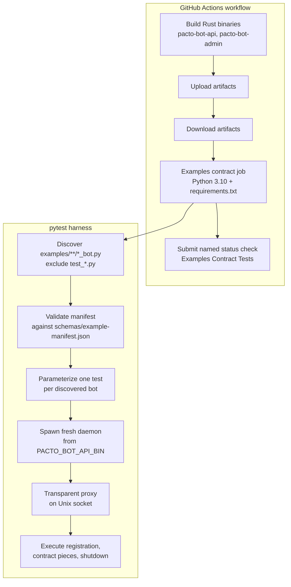

## Summary

Add a CI job that discovers every example bot in `examples/`, validates each against a per-bot manifest of JSON-RPC contract pieces over the Unix socket, and reports results as an allowed-to-fail informational status check. The job consumes a `pacto-bot-api` binary artifact produced by the Rust build step and graduates to a required merge gate after 30 consecutive days with zero manifest-related failures on `main`.

---

## Problem Frame

Example bots in `examples/` are the primary reference implementations that bot developers copy and adapt. Today they are not exercised automatically in CI, so their JSON-RPC contract usage can drift from the daemon without any failing build. The first signal of drift is usually a confused user rather than a failing check. The project already has pytest fixtures that spawn the daemon and speak the contract; the missing piece is automated, repeatable CI execution with a stable definition of what each example must demonstrate.

---

## Requirements

### Contract harness

- R1. (origin R1) The CI job discovers every example bot file matching `examples/**/*_bot.py` recursively, excluding test files.
- R2. (origin R1a) The CI job fails with a clear diagnostic when a discovered bot has no corresponding manifest file.
- R3. (origin R2) The job reads a manifest at the bot file's stem with `.manifest.json` appended in the same directory (for example, `examples/greet_bot.py` uses `examples/greet_bot.manifest.json`), declaring which contract pieces the example exercises.
- R4. (origin R3) The harness exercises registration, clean shutdown, and any declared contract pieces by default. A manifest may opt out of registration and/or shutdown for partial or specialized examples.
- R5. (origin R4/R4a) A contract piece may declare an expected-error outcome that matches by JSON-RPC error code, with an optional message substring for disambiguation.
- R6. (origin R5) Each contract piece has a deterministic timeout and produces a pass/fail result with a clear diagnostic on failure. The default timeout is 30 seconds; individual pieces may override it in the manifest.
- R7. (origin R5a) The harness spawns a fresh daemon process for each example bot and shuts it down cleanly after the example completes, preventing cross-example state leakage.

### CI integration

- R8. (origin R6) The job runs on every pull request and on every push to `main`.
- R9. (origin R7) The job uses a `pacto-bot-api` binary artifact produced by the Rust build step (for example, `target/debug/pacto-bot-api` or a CI-uploaded artifact).
- R10. (origin R8) The job runs over Unix socket transport only.
- R11. (origin R9) The job is allowed-to-fail initially and reports its results as a separate, named CI check via a custom status-check submission step.
- R12. (origin R9a) The job is promoted to a required gate after 30 consecutive days with zero manifest-related failures on `main`.
- R13. (origin R10) CI installs Python 3.10+ and the dependency set declared in `examples/requirements.txt`.
- R14. (origin R17) The Rust CI job builds and uploads `pacto-bot-api` and `pacto-bot-admin` binary artifacts on every pull request and on every push to `main` so the examples job does not recompile the daemon.
- R15. (origin R18) The examples harness generates test keys locally or uses a pre-built `pacto-bot-admin` binary; it does not invoke `cargo run` per discovered example.
- R16. (origin R19) The harness creates each Unix socket in a temporary directory under `/tmp` with a path well under the AF_UNIX limit and removes the socket after each example.

### Manifest versioning

- R17. (origin R11) Each manifest declares its own `manifest_version`, independent of the daemon's JSON-RPC schema version. The harness rejects manifests whose declared version is not supported by `schemas/example-manifest.json`.
- R18. (origin R12) When `schemas/example-manifest.json` changes, the examples CI job validates every manifest against the updated schema and fails on any unsupported contract piece or field. Changes to `schemas/example-manifest.json` require a manifest-format review via required PR review.
- R19. (origin R13) The manifest schema is defined in `schemas/example-manifest.json` and versioned separately from `schemas/jsonrpc.json`.

---

## Key Technical Decisions

- **KTD-1. Manifest filename derives directly from the bot filename.** A bot at `examples/greet_bot.py` uses `examples/greet_bot.manifest.json`. This keeps the mapping explicit and colocated without stripping a magic `_bot` suffix. (origin: R1, R3)
- **KTD-2. Extend existing pytest fixtures rather than introduce a separate test runner.** `examples/conftest.py` already spawns the daemon, connects a JSON-RPC client, and provides a mock relay. Discovery, manifest loading, and contract execution build on those fixtures. A dedicated helper module is introduced only if `conftest.py` becomes unwieldy. (origin: Dependencies / Assumptions)
- **KTD-3. Validate manifests with the `jsonschema` Python library.** The harness loads `schemas/example-manifest.json` once and validates every discovered manifest before running the bot. This is lightweight and integrates cleanly with pytest diagnostics. (origin: R17, R18)
- **KTD-4. CI and local binary lookup order.** The harness resolves the daemon and admin binaries in this order: `PACTO_BOT_API_BIN` / `PACTO_BOT_ADMIN_BIN` environment variables, `CARGO_BIN_EXE_*` Cargo vars, `target/debug/pacto-bot-api` / `target/debug/pacto-bot-admin`, then `cargo` only as a local-development fallback. CI always sets the env vars to downloaded artifacts. (origin: R9, R14, R15)
- **KTD-5. Allowed-to-fail visibility via `continue-on-error` plus a github-script status submission.** The test job uses `continue-on-error: true` so failures do not block merge; a subsequent step with `if: always()` reads `steps.pytest.outcome` and submits a named status check (`Examples Contract Tests`) that surfaces the actual outcome in the PR checks list. (origin: R11)
- **KTD-6. Observe bot-originated notifications through a transparent Unix-socket proxy.** The harness inserts a local proxy between the example bot and the daemon. The proxy forwards all traffic and records `handler.response` (and any other bot-to-daemon notifications) so the harness can assert on them without changing the daemon. (origin: R3, AE1)

---

## High-Level Technical Design

Each example bot runs in its own temporary `data_dir` under `/tmp` with a short Unix socket path. The harness writes a per-example TOML config using locally generated bot keys, starts the daemon binary, creates a transparent proxy on the Unix socket, and starts the example bot connected to the proxy. The proxy forwards all traffic to the daemon and records bot-originated notifications such as `handler.response` so the harness can assert on them. The harness then drives the contract pieces declared in the manifest. After the pieces complete—or the timeout fires—the harness sends SIGINT, waits for shutdown, and deletes the socket.

---

## Implementation Units

### U1. Define per-bot manifest schema

**Goal:** Publish a canonical JSON Schema for per-bot example manifests.

**Requirements:** R17, R18, R19

**Dependencies:** none

**Files:**
- `schemas/example-manifest.json` (create)
- `examples/echo_bot.manifest.json` (create, in U5)

**Approach:** Define `schemas/example-manifest.json` as a draft-07 JSON Schema. Top-level fields include `manifest_version` (string enum), `bot_file` (filename string), `registration` (boolean, default true), `shutdown` (boolean, default true), and `contract_pieces` (array of piece objects). Each contract piece declares a `name`, `type` (enum: `rpc_call`, `notification`, `event_response`, `expected_error`), `timeout_seconds` (optional), and type-specific fields such as `method`, `params`, `expect`, and `expect_error`. An `expected_error` piece contains `code` and optional `message_contains`.

**Patterns to follow:** Mirror the schema structure and naming conventions in `schemas/jsonrpc.json` and `schemas/config.json`.

**Test scenarios:**
- A valid manifest for `echo_bot.py` validates against the schema.
- A manifest declaring an unsupported `manifest_version` is rejected with a clear diagnostic.
- A manifest with an unknown contract-piece type is rejected.

**Verification:** `jsonschema` validates the example manifest without errors; invalid fixtures fail with readable messages.

---

### U2. Parameterized example discovery and manifest loading

**Goal:** Discover every `*_bot.py` under `examples/` and load its corresponding manifest.

**Requirements:** R1, R2, R17

**Dependencies:** U1

**Files:**
- `examples/conftest.py` (modify)
- `examples/test_examples_contract.py` (create)

**Approach:** Add a pytest collection hook or parametrized test in `examples/test_examples_contract.py` that walks `examples/` recursively, skips dot directories (`.venv`, `__pycache__`), skips `test_*.py`, and matches `*_bot.py`. For each bot, derive the manifest path as `<bot_stem>.manifest.json` in the same directory. If the manifest file is missing, the test fails with a diagnostic naming the bot file. If the manifest file exists, it is loaded and validated against `schemas/example-manifest.json` before any daemon is spawned.

**Patterns to follow:** Use the existing `_repo_root()` helper and `pytest.mark.parametrize` pattern already present in the codebase.

**Test scenarios:**
- `pytest --collect-only examples/` lists one parameterized test for each `*_bot.py` and no tests for `test_*.py` files.
- A bot file without a manifest causes collection-time or test-time failure with a clear message.
- A malformed manifest causes a schema-validation failure naming the file.
- A manifest declaring an unsupported `manifest_version` is rejected before the daemon spawns.

**Verification:** Running the harness against the current `examples/` directory discovers `echo_bot.py` and loads `echo_bot.manifest.json`.

---

### U3. Daemon lifecycle helper

**Goal:** Provide a reusable, manifest-agnostic helper that spawns a fresh daemon and shuts it down cleanly for a single example run.

**Requirements:** R7, R16

**Dependencies:** U2

**Files:**
- `examples/conftest.py` (modify)

**Approach:** Add a context manager or fixture factory in `examples/conftest.py` that:
1. Generates bot keys using the resolved admin binary (R15).
2. Creates a short temporary directory under `/tmp`.
3. Writes a `pacto-bot-api.toml` config pointing at that `data_dir` and socket.
4. Spawns the daemon binary from the resolved path.
5. Waits for the socket using `_async_wait_for_socket`.
6. Yields the socket path and process handle.
7. On exit, sends SIGINT, waits for shutdown, and removes the socket and temporary directory.

**Patterns to follow:** Reuse `_short_tmp_dir`, `_write_config`, `_async_wait_for_socket`, and the daemon cleanup logic already in `conftest.py`.

**Test scenarios:**
- A daemon spawned by the helper starts and accepts a socket connection.
- A daemon shuts down cleanly on context exit.
- Two consecutive invocations use fresh `data_dir` and socket paths; no state leaks between runs.

**Verification:** Unit-style tests for the helper pass, and the helper is reused by the contract executor in U4.

---

### U4. Manifest-driven contract executor

**Goal:** Run each discovered bot against a fresh daemon, executing the contract pieces declared in its manifest and observing bot-originated notifications.

**Requirements:** R4, R5, R6

**Dependencies:** U2, U3

**Files:**
- `examples/conftest.py` (modify)
- `examples/test_examples_contract.py` (modify)

**Approach:** Build on U3. For each bot:
1. Start the daemon through the lifecycle helper.
2. Create a transparent Unix-socket proxy between the bot's expected socket path and the daemon's real socket, recording all traffic.
3. Connect a `DaemonClient` to the real daemon socket.
4. Start the example bot pointed at the proxy socket.
5. Call `handler.register` via `DaemonClient` unless the manifest opts out.
6. For each contract piece, send the declared JSON-RPC request/notification and assert the expected response, event, or error:
   - `rpc_call`: send a request and assert the result.
   - `notification`: send a notification and assert the daemon accepts it.
   - `event_response`: use the mock relay or an `agent.inject_event` test helper to push an `agent.event`, then assert the bot emits the expected `handler.response` recorded by the proxy.
   - `expected_error`: send a request and assert the returned JSON-RPC error matches `code` and optional `message_contains`.
7. Send SIGINT for clean shutdown unless the manifest opts out.
8. Stop the proxy and clean up.

Default piece timeout is 30 seconds; per-piece `timeout_seconds` overrides it. Timeout failures produce a diagnostic naming the bot, piece name, and timeout.

**Patterns to follow:** Reuse `DaemonClient` and `MockRelay` from `conftest.py`. Model the proxy on the mock-daemon socket used in `examples/test_echo_bot.py`.

**Test scenarios:**
- `echo_bot` registers, receives an `agent.event` for `/echo hello`, and emits a `handler.response` with `action: reply` and the echoed content.
- An `expected_error` piece passes when the daemon returns the declared error code (for example, `-32006`).
- A piece that times out produces a diagnostic naming the bot, piece name, and timeout.

**Verification:** `pytest examples/test_examples_contract.py` passes for `echo_bot.py` using the manifest created in U5.

---

### U5. Manifest for echo_bot and binary-aware key generation

**Goal:** Provide the first per-bot manifest and ensure key generation uses a pre-built admin binary when available.

**Requirements:** R15, AE1

**Dependencies:** U1, U4

**Files:**
- `examples/echo_bot.manifest.json` (create)
- `examples/conftest.py` (modify)
- `examples/requirements.txt` (modify)

**Approach:** Create `examples/echo_bot.manifest.json` with `manifest_version: "1"`, registration and shutdown enabled, and contract pieces that exercise `handler.register`, `agent.event` → `handler.response` for an `/echo` command, and an ignored non-echo message. Update `_generate_bot_keys` to resolve the admin binary using the order in KTD-4 (`PACTO_BOT_ADMIN_BIN`, `CARGO_BIN_EXE_pacto-bot-admin`, `target/debug/pacto-bot-admin`). Remove the `cargo run` fallback for CI; keep it only as a last-resort local development fallback. Update `_daemon_bin()` to use the same lookup order for `PACTO_BOT_API_BIN`. Add `jsonschema>=4.0` to `examples/requirements.txt`.

**Patterns to follow:** Keep the existing `nsec` backend test-key path; only change binary resolution.

**Test scenarios:**
- `echo_bot.manifest.json` validates against `schemas/example-manifest.json`.
- Keys are generated using the pre-built admin binary when `PACTO_BOT_ADMIN_BIN` is set.
- The echo bot contract pieces pass end-to-end.

**Verification:** `pytest examples/test_examples_contract.py::test_example_contract[echo_bot.py]` passes with a pre-built admin binary.

---

### U6. CI workflow with artifact passing and allowed-to-fail status check

**Goal:** Build Rust binaries once per PR/push and run the examples harness as an allowed-to-fail informational check.

**Requirements:** R8, R9, R10, R11, R13, R14

**Dependencies:** U4, U5

**Files:**
- `.github/workflows/ci.yml` (modify)

**Approach:** Add a `build-binaries` job that runs on PR and push to `main`, builds `pacto-bot-api` and `pacto-bot-admin` in debug mode, and uploads both via `actions/upload-artifact@v4`. Add an `examples-contract` job that `needs: build-binaries`, sets `continue-on-error: true`, requests `permissions: statuses: write`, downloads the artifacts, installs Python 3.10, installs `examples/requirements.txt`, and runs `pytest examples/` with `PACTO_BOT_API_BIN` and `PACTO_BOT_ADMIN_BIN` pointing to the downloaded artifacts. Add a final step with `if: always()` using `actions/github-script@v7` to read `steps.pytest.outcome` and submit a status check named `Examples Contract Tests` with the actual outcome.

Document the tradeoff that this job duplicates a debug build already performed by the `test` job; accept the extra build cost in exchange for a stable artifact path and independence from coverage-tool output.

**Patterns to follow:** Match the existing artifact upload/download patterns in `.github/workflows/ci.yml`.

**Test scenarios:**
- The `build-binaries` job uploads both binaries as artifacts.
- The `examples-contract` job downloads and executes them without invoking Cargo.
- A failing examples run does not fail the workflow but still submits a failed `Examples Contract Tests` status check.
- A passing examples run submits a successful status check.

**Verification:** Open a PR and confirm the `Examples Contract Tests` check appears and reflects the harness outcome.

---

### U7. Manifest-format review gate and graduation criteria

**Goal:** Enforce review for manifest schema changes and document the path to making the examples job required.

**Requirements:** R12, R18

**Dependencies:** U1, U6

**Files:**
- `CODEOWNERS` (create or modify)
- `.github/workflows/ci.yml` (modify, comment)
- `docs/plans/2026-06-28-001-feat-python-examples-ci-contract-tests-plan.md` (this plan, operational notes)

**Approach:** Create or update `CODEOWNERS` so that `schemas/example-manifest.json` requires review by a designated maintainer team. In `.github/workflows/ci.yml`, add comments near the `examples-contract` job noting that branch protection must also require review for `schemas/example-manifest.json` changes, and mark the `continue-on-error: true` line with the 30-day graduation window. Document in this plan that a repo admin must enable the branch-protection rule before R12 is fully enforced.

**Patterns to follow:** Use `CODEOWNERS` for path-based review requirements; use workflow comments for procedural gates that cannot be encoded in YAML.

**Test scenarios:**
- A PR changing `schemas/example-manifest.json` is routed to the designated CODEOWNERS reviewer.
- An invalid manifest fails the examples job with a schema-validation diagnostic.

**Verification:** The repository contains a `CODEOWNERS` entry for `schemas/example-manifest.json`; branch protection is configured by a repo admin; workflow comments explain the allowed-to-fail behavior and graduation criteria.

---

## Scope Boundaries

### Deferred for later

- HTTP transport contract tests for examples.
- Generated Python client derived from `schemas/jsonrpc.json`.
- Windows CI examples job.
- `status` contract-piece verb and any bot-status-specific examples.

### Outside this product's identity

- Rewriting the example bots in another language (they stay Python).
- Changing the daemon's transport layer to support this work.

### Deferred to follow-up work

- Adding new example bots beyond `echo_bot`. This plan creates only the `echo_bot.manifest.json` manifest; additional example bots ship in separate work.
- Automating the 30-day graduation counter. Graduation is tracked manually by inspecting `main` branch history; no dashboard or bot is added in this plan.

---

## Acceptance Examples

- AE1. A new `examples/greet_bot.py` that registers, receives a matching `agent.event`, and emits a `handler.response` with expected action and payload passes CI without adding per-bot test code. Covered by the parameterized discovery in U2, the transparent proxy observation in U4, and the manifest created in U5.
- AE2. An example that declares an expected JSON-RPC error code (for example, `-32006` for an unauthorized bot) for a missing capability passes when the daemon returns that code. Covered by the `expected_error` contract-piece type in U1 and the executor in U4.
- AE3. A change to `schemas/jsonrpc.json` that removes a method or field used by an example's manifest causes the examples CI job to fail with a runtime contract-piece assertion naming the affected example and the missing method or field. Covered by the contract-piece assertions in U4.

---

## Risks & Dependencies

- **Binary artifact size and transfer time.** Uploading two Rust binaries on every PR adds CI time and storage. Mitigation: use debug builds for the examples job; retention is short (14 days or less); the extra build is accepted as a cost of a stable artifact path.
- **Allowed-to-fail visibility.** `continue-on-error: true` means a red `Examples Contract Tests` status check can be ignored unless reviewers are disciplined. Mitigation: the named status check makes failures visible; graduation to required gate happens only after a stable 30-day window.
- **Branch protection for schema changes.** Required PR review for `schemas/example-manifest.json` requires both a `CODEOWNERS` entry and a repo-admin update to branch-protection rules. This is documented in U7 but the admin step is not automated.
- **Fork-PR status-check permissions.** Submitting a status check via `actions/github-script` requires `statuses: write`, which the default `GITHUB_TOKEN` does not grant to pull requests from forks. Mitigation: document that fork PRs require maintainer approval or a trusted bot token, or accept that the status check is omitted for forks.
- **Admin CLI coupling.** `_generate_bot_keys` depends on the `pacto-bot-admin new` output format. If that format changes, the harness breaks. Mitigation: add a dedicated parser test and consider adding a machine-readable output flag to `pacto-bot-admin new` in follow-up work.
- **Operational graduation tracking.** The 30-day stability window is measured manually; there is no automated enforcement. Mitigation: add a calendar reminder and a code comment in the workflow noting the graduation condition.
- **Proxy observation correctness.** The transparent socket proxy must not alter framing or timing in ways that mask real contract failures. Mitigation: keep the proxy simple (readline, forward, record) and verify it with a round-trip test.

---

## Sources & Research

- `docs/brainstorms/2026-06-28-python-examples-ci-contract-tests-requirements.md` — origin requirements doc.
- `examples/conftest.py` — existing pytest fixtures that spawn the daemon and provide `DaemonClient` and `MockRelay`.
- `examples/test_echo_bot.py` — existing contract test for the echo bot, including the mock-daemon socket pattern used for proxy inspiration.
- `examples/echo_bot.py` — reference bot that consumes `handler.register` and `agent.event` notifications.
- `schemas/jsonrpc.json` — canonical JSON-RPC method catalog the examples rely on.
- `.github/workflows/ci.yml` — current Rust-only CI pipeline extended by this plan.
