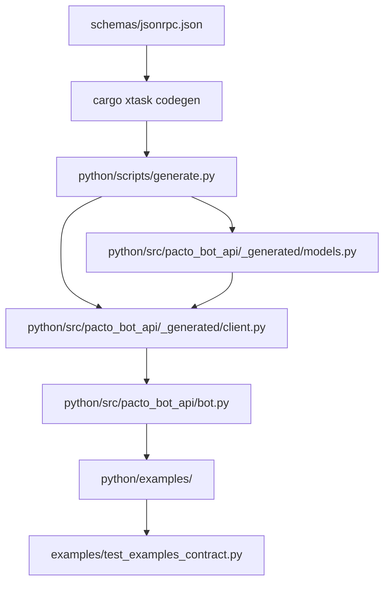

# Generated Python Client SDK

## Summary

Create a generated Python SDK under `python/` that is produced from `schemas/jsonrpc.json` via `cargo xtask codegen`. The SDK exposes Pydantic v2 models, a low-level async client, and a hand-written decorator-based `Bot` layer. Example bots live in `python/examples/` and are validated by the existing contract harness. Documentation is written for both humans and LLMs.

## Problem Frame

The daemon binary (`pacto-bot-api`) already generates Rust types from `schemas/jsonrpc.json` and enforces sync with `tests/schema_sync.rs`, while the lifecycle CLI is `pacto-bot-admin`. The Python side relies on a hand-written seed (`examples/pacto_sdk.py`) that must be updated manually for every schema change. The seed is explicitly temporary. A generated, typed Python client is needed so bot authors can write against a stable, schema-synced API, and so an LLM pointed at the repo can infer how to write a complete bot without reading daemon source.

## Requirements

Origin: `docs/brainstorms/2026-06-29-generated-python-client-requirements.md` (R1–R17).

### Code generation

* R1. `cargo xtask codegen` invokes a Python generator that reads `schemas/jsonrpc.json` and emits the client package under `python/`.

* R2. The generator emits Pydantic v2 models for every JSON-RPC method parameter, result, notification, and event type.

* R3. The generator emits a low-level async client class with one typed method per JSON-RPC method.

* R4. Generated names use Pythonic `snake_case` and include docstrings derived from the schema summary and description fields.

### Package structure

* R5. The package is installable in editable mode from `python/pyproject.toml`.

* R6. A hand-written high-level layer provides a decorator-based `Bot` class and a small command parser.

* R7. The high-level layer supports both Unix socket and HTTP+SSE transports.

* R8. The package exposes a clear public API (for example, `from pacto_bot_api import Bot, PactoClient`).

### Examples and validation

* R9. Example bots live in `python/examples/` and import the generated package.

* R10. At least one example demonstrates a complete bot in roughly 30 lines of business logic using the high-level layer.

* R11. Example files are excluded from the PyPI wheel.

* R16. `tests/schema_sync.rs` fails if the generated Python client is stale relative to `schemas/jsonrpc.json`.

* R17. The Python generator is idempotent: repeated runs on the same schema produce no diff.

### Documentation

* R12. The package README includes installation, a quickstart snippet, and links to every example. &#x20;

* R13. Every generated model and client method includes a docstring with its JSON-RPC method name, summary, and a usage example.

* R14. The README and docstrings present the canonical bot loop: register → receive `agent.event` notifications of type `dm_received` → dispatch command → return `handler.response`.

* R15. Examples include docstrings explaining what the bot does, which capabilities it needs, and how to run it.

## Key Technical Decisions

* **Python generator script invoked by Rust xtask.** A Python script under `python/scripts/generate.py` reads the schema and emits the package. `xtask/src/codegen.rs` shells out to it during `cargo xtask codegen`. This keeps the unified developer command while letting Python maintainers control Pydantic output and AI-first docstrings.

* **Generated low-level layer + hand-written high-level layer.** `python/src/pacto_bot_api/_generated/` holds models and the low-level client. `python/src/pacto_bot_api/bot.py` and `parser.py` are hand-written. This keeps the generator stable and small while examples stay ergonomic.

* **External** **`$ref`** **results modeled as** **`dict[str, Any]`** **initially.** `agent.metrics` and `agent.version` reference `metrics.json` and `version.json`. The first iteration emits their results as `dict[str, Any]` rather than blocking on full cross-schema modeling.

* **Contract harness extended to** **`python/examples/`.** The existing parameterized harness in `examples/test_examples_contract.py` discovers `examples/**/*_bot.py`. Update discovery to also scan `python/examples/` so new SDK examples are validated by the same manifest/contract mechanism.

* **No PyPI publication in this iteration.** The package is editable-install from the repo. Publishing and independent versioning are deferred.

## High-Level Technical Design



The schema remains the single source of truth. `cargo xtask codegen` invokes the Python generator, which emits typed Pydantic models and a low-level async client. A hand-written `Bot` class and command parser sit on top. Examples in `python/examples/` exercise the high-level API and are validated by the existing contract harness.

## Implementation Units

### U1. Scaffold Python package and codegen invocation

**Goal:** Create the `python/` package layout and wire the Python generator into `cargo xtask codegen`.

**Requirements:** R1, R5, R8, R11

**Dependencies:** none

**Files:**

* `python/pyproject.toml` (create)

* `python/src/pacto_bot_api/__init__.py` (create)

* `python/src/pacto_bot_api/_generated/__init__.py` (create)

* `python/scripts/generate.py` (create)

* `xtask/src/codegen.rs` (modify)

**Approach:**
Add `python/pyproject.toml` with Pydantic v2 as a runtime dependency, `pytest` and `pytest-asyncio` as dev dependencies, and package discovery excluding `examples/` and `tests/` from the wheel (for example, `[tool.setuptools.packages.find] exclude = ["examples", "tests"]` or the Hatch/PDM equivalent). Create the source skeleton and re-export `Bot` and `PactoClient` in `python/src/pacto_bot_api/__init__.py` once those symbols exist. Add a `generate_python()` step in `xtask/src/codegen.rs` that runs the Python generator with the workspace root path, ensuring the active virtualenv or `python3` is used. Print a success line matching the existing Rust generation output.

**Patterns to follow:**

* Keep package naming consistent with the crate (`pacto_bot_api`).

* Mirror the generated-file header pattern from `src/transport/protocol_generated.rs`: a comment stating the file is generated and the regeneration command.

**Test scenarios:**

* `pip install -e python/` succeeds in a fresh virtualenv.

* `cargo xtask codegen` runs without error and emits the generated Python files.

* Running `cargo xtask codegen` twice in a row produces no diff.

**Verification:**

* `python -c "import pacto_bot_api; print(pacto_bot_api.__version__)"` succeeds.

* `git diff --exit-code python/src/pacto_bot_api/_generated/` after two codegen runs is clean.

### U2. Implement Python schema-to-Pydantic generator

**Goal:** Read `schemas/jsonrpc.json` and emit Pydantic v2 models for params, results, notifications, and events.

**Requirements:** R2, R4, R13

**Dependencies:** U1

**Files:**

* `python/scripts/generate.py` (modify)

* `python/src/pacto_bot_api/_generated/models.py` (create/generated)

**Approach:**
Parse the OpenRPC catalog in `schemas/jsonrpc.json`. For each method, emit a request params model and a result model when present. For each notification, emit a params model. Map JSON Schema types to Pydantic types:

* `string` → `str`

* `integer` → `int`

* `boolean` → `bool`

* `array` → `list[T]`

* `object` with known properties → generated model

* unresolved `$ref` or any other type → `dict[str, Any]`

Use the schema `required` array to decide `Optional` fields. Generate class names from method/notification names converted to `PascalCase`. For nested inline object schemas, name models as `{Parent}{Property}Model` (for example, `HandlerRegisterParamsBotIdsModel`). Add docstrings from `summary` and `description`, and include a `jsonrpc_method` class attribute for methods when useful for debugging.

**Execution note:** Start with a generator test that snapshots a known schema method and asserts the emitted model shape.

**Patterns to follow:**

* Sort emitted classes alphabetically to ensure deterministic output.

* Use `from __future__ import annotations` and `| None` syntax for optional fields.

**Test scenarios:**

* `HandlerRegisterParams` has required `bot_ids`, `event_types`, `capabilities` fields and no defaults.

* `AgentEvent` has required `content`, `rumor_id`, `author`, and `timestamp` fields and optional `chat_id`.

* `AgentMetricsResult` is emitted as `dict[str, Any]` because its `$ref` is not resolved in the first iteration.

* Re-running the generator on the same schema produces byte-identical output.

**Verification:**

* `python/tests/test_generated_models.py` passes and validates model construction from sample data.

* `tests/schema_sync.rs` will cover stale-output detection after U8.

### U3. Generate low-level async client

**Goal:** Emit a typed, transport-agnostic async client with one method per JSON-RPC method.

**Requirements:** R3, R4, R13

**Dependencies:** U2

**Files:**

* `python/scripts/generate.py` (modify)

* `python/src/pacto_bot_api/_generated/client.py` (create/generated)

**Approach:**
Emit a class named `PactoClient`. The generated client accepts a transport object that provides `connect()`, `readline()`, `write_frame(dict)`, and `close()` methods. It maintains an in-flight request table keyed by JSON-RPC `id`. For each JSON-RPC request/response method, generate an async method that builds the request dict, writes it, and awaits the correlated response. `agent.send_dm` and `agent.set_profile` are request/response methods; `agent.error` is an outgoing notification. For outgoing notifications (`agent.error`, `handler.response`), generate methods that fire and forget. Expose incoming daemon-to-bot notifications (`agent.event`, `agent.status`) via an async iterator or callback hook so the Bot layer can consume them. Map dotted method names (`handler.register`) to `snake_case` (`handler_register`). Return typed Pydantic models from U2.

**Patterns to follow:**

* Keep the client transport-agnostic so U4 can provide Unix and HTTP adapters without regenerating code.

* Use `uuid.uuid4()` for request ids, matching `examples/echo_bot.py`.

**Test scenarios:**

* `client.handler_register(...)` sends a JSON-RPC request with method `handler.register` and returns a parsed result model.

* `client.agent_send_dm(...)` sends a request with method `agent.send_dm` and awaits a string event id result.

* Correlating a response with the wrong `id` raises an error or logs a warning.

* Unknown inbound frames are logged and ignored.

**Verification:**

* Unit tests drive the client against a mock transport and assert sent frames and parsed results.

### U4. Implement transport adapters

**Goal:** Provide Unix socket and HTTP+SSE transport objects for the low-level client.

**Requirements:** R7

**Dependencies:** U3

**Files:**

* `python/src/pacto_bot_api/transports.py` (create)

* `python/tests/test_transports.py` (create)

**Approach:**
Define a transport protocol (abstract base class or Protocol) with `connect()`, `readline()`, `write_frame(dict)`, and `close()`. Implement `UnixTransport` using `asyncio.open_unix_connection`. Implement `HttpTransport` using `asyncio.open_connection` to a host:port, sending `POST /` with `X-Pacto-Bot-Secret`, and consuming `GET /events?handler_id=<id>` as a text/event-stream. For mutating calls (`agent.send_dm`, `agent.set_profile`, `agent.error`), attach `X-Pacto-Handler-Id`.

**Patterns to follow:**

* Derive socket path from `--socket`, `$PACTO_SOCKET`, `--data-dir`, `$PACTO_DATA_DIR`, or a default, matching `examples/pacto_sdk.py`.

* Read the HTTP secret from `--secret`, `$PACTO_SECRET_TOKEN`, or the `bot_secret_token` file in the data dir, matching the daemon's conventions.

**Test scenarios:**

* `UnixTransport` connects to a mock Unix socket, writes NDJSON frames, and reads NDJSON frames.

* `HttpTransport` sends a POST with the correct secret and handler-id headers for mutating calls.

* `HttpTransport` parses SSE `data:` lines as NDJSON frames and ignores `event:` lines.

* Missing secret raises a clear error at connection time.

**Verification:**

* `pytest python/tests/test_transports.py` passes.

### U5. Implement high-level Bot layer

**Goal:** Provide a decorator-based `Bot` class and command parser built on the generated client.

**Requirements:** R6, R7

**Dependencies:** U3, U4

**Files:**

* `python/src/pacto_bot_api/bot.py` (create)

* `python/src/pacto_bot_api/parser.py` (create)

* `python/tests/test_bot.py` (create)

**Approach:**
`Bot(bot_id: str, transport: Transport | str | None = None, ...)` installs signal handlers, creates the selected transport, creates the low-level `PactoClient`, registers the handler, and dispatches incoming `agent.event` notifications. Transport selection follows the same precedence as `examples/pacto_sdk.py`: a passed transport object, then `--socket` / `--data-dir` / `--transport` / `--secret` / `--http-bind` CLI flags and their environment-variable fallbacks. `@bot.command("/hello")` registers an async callback keyed by the command name. `@bot.default` registers a fallback. `@bot.status` registers a callback for `agent.status` notifications. The command parser splits content into command, positional args, and flags using the grammar `/command arg1 arg2 --flag value --bool` with the same defensive limits as `examples/pacto_sdk.py`. Handler callbacks receive an event model and a context object with helper methods `reply`, `ack`, `defer`, `ignore`, `send_dm`, and `set_profile`.

**Patterns to follow:**

* Strip the leading `/` before registry lookup so `@bot.command("hello")` and `@bot.command("/hello")` are equivalent.

* Mirror `examples/pacto_sdk.py` logging prefix (`[<bot-id>]`) and stderr output.

**Test scenarios:**

* A registered `/hello` handler receives the parsed command and returns a reply.

* An unknown command routes to the default handler if one is registered.

* An unknown command without a default returns `ignore`.

* `Bot` sends `handler.register` with the configured `bot_ids`, `event_types`, and `capabilities`.

* Graceful shutdown on `SIGINT` cancels the read loop and closes the transport.

**Verification:**

* `pytest python/tests/test_bot.py` passes against a mock transport.

### U6. Add example bots in `python/examples/`

**Goal:** Demonstrate the SDK with one or more concise, runnable example bots.

**Requirements:** R9, R10, R15

**Dependencies:** U5

**Files:**

* `python/examples/greeting_bot.py` (create)

* `python/examples/greeting_bot.manifest.json` (create)

* `python/examples/joke_bot.py` (create, optional)

* `python/examples/joke_bot.manifest.json` (create, optional)

* `examples/conftest.py` (modify)

* `examples/test_examples_contract.py` (modify)

**Approach:**
Create `greeting_bot.py` as a \~30-line bot that responds to `/hello` with a friendly reply and ignores unknown commands. Use the high-level `Bot` decorator API and accept the same CLI flags as existing examples so the contract harness can launch it. Add a matching manifest for the contract harness. Optionally add `joke_bot.py` to exercise the `defer` action and proactive `send_dm`. Update `examples/conftest.py::discover_bot_files()` to scan both `examples/` and `python/examples/` so the parameterized harness discovers the new bots.

**Patterns to follow:**

* Follow the manifest structure in `examples/echo_bot.manifest.json` and `examples/greeting_bot.manifest.json`.

* Include a module docstring stating required capabilities and how to run the bot.

**Test scenarios:**

* `python/examples/greeting_bot.py` passes the contract harness when driven with `/hello`.

* Unknown commands produce `action: ignore`.

* If `joke_bot.py` is added, `/joke` returns `action: defer` and a later proactive `agent.send_dm` delivers the punchline.

**Verification:**

* `pytest examples/test_examples_contract.py` discovers and passes the new example(s).

### U7. Add Python SDK tests

**Goal:** Provide unit and integration tests for the generated models, client, transports, and Bot layer.

**Requirements:** R2, R3, R6, R7

**Dependencies:** U2, U3, U4, U5

**Files:**

* `python/tests/test_generated_models.py` (create)

* `python/tests/test_client.py` (create)

* `python/tests/conftest.py` (create, shared fixtures)

* `python/pyproject.toml` (modify, add pytest config)

**Approach:**
Create shared pytest fixtures in `python/tests/conftest.py` for mock transports. Add `test_generated_models.py` for model construction and validation and `test_client.py` for request/response correlation. Transport-specific and Bot-layer tests are owned by U4 and U5 respectively. Add `tool.pytest.ini_options` to `python/pyproject.toml` so `pytest python/` works.

**Patterns to follow:**

* Use `pytest-asyncio` for async tests.

* Avoid mocking the generated models; test them with real instances.

**Test scenarios:**

* Each generated model can be constructed from valid sample data and fails validation with invalid data.

* The client correlates responses by request id.

* The Bot dispatches commands and sends the returned response action.

* Transport adapters handle read/write errors gracefully.

**Verification:**

* `pytest python/tests/` passes.

### U8. Extend schema sync gate to Python

**Goal:** Ensure `tests/schema_sync.rs` fails when the generated Python client is stale.

**Requirements:** R16, R17

**Dependencies:** U1, U2, U3

**Files:**

* `tests/schema_sync.rs` (modify)

* `python/scripts/generate.py` (modify, ensure idempotency)

**Approach:**
Add the generated Python files (for example, `python/src/pacto_bot_api/_generated/models.py` and `python/src/pacto_bot_api/_generated/client.py`) to a Python-specific tracked list. In the existing schema-sync test, snapshot the committed files, run `cargo xtask codegen`, and compare the regenerated Python files to their snapshots. Ensure the Python generator emits classes in deterministic order and uses stable string formatting so repeated runs produce identical output.

**Patterns to follow:**

* Mirror the existing `TRACKED_GENERATED_FILES` and snapshot-diff pattern.

* Keep Python file checks separate from Rust file checks so failures name the stale file clearly.

**Test scenarios:**

* A committed generated file that matches the schema passes the sync test.

* A committed generated file that drifts from the schema fails the sync test with a diff.

* Running `cargo xtask codegen` twice produces no diff in the generated Python files.

**Verification:**

* `cargo test --test schema_sync` passes on a clean checkout after Python 3.10+ and the generator dependencies are installed.

* Deliberately editing a generated model without regenerating causes the test to fail.

### U9. Documentation and CI updates

**Goal:** Ship AI-first README and update CI to install and test the Python SDK.

**Requirements:** R12, R14, R15

**Dependencies:** U1, U6, U7

**Files:**

* `python/README.md` (create)

* `.github/workflows/ci.yml` (modify)

* `docs/python-sdk.md` (modify, update references)

**Approach:**
Write `python/README.md` with installation (`pip install -e python/`), a quickstart snippet using the `Bot` decorator, a capabilities guide, and links to every example. In the quickstart, use only real CLI commands: create bot identities with `pacto-bot-admin new`, publish profiles with `pacto-bot-admin publish-profile`, and run the daemon with `pacto-bot-api --config ...`. Do not invent commands like `pacto bunker init` or `pacto bot create`; defer any bunker-specific lifecycle command that does not yet exist. Update `.github/workflows/ci.yml` to set up Python 3.10+, install the generator dependencies, install the SDK (`pip install -e python/`), and run `pytest python/tests/` and the examples contract harness. Document the Python dependency in `DEVELOPMENT.md`. Update `docs/python-sdk.md` to point to the generated SDK and note that `examples/pacto_sdk.py` is no longer maintained.

**Patterns to follow:**

* Follow the LLM-guide style in `docs/pacto-bot-admin-llms.txt`: placeholders for secrets, explicit capability requirements, and a "When to use which" section.

* Keep docstrings in generated code concise but complete: method name, one-line summary, param names, and a mini usage example.

**Test scenarios:**

* The README quickstart can be copied into a new file and run with only environment-specific substitutions.

* CI installs the SDK and runs its test suite without error.

**Verification:**

* Manual review: README renders without broken links and contains all required sections.

* CI passes on the PR branch.

## Scope Boundaries

### Deferred for later

* Publishing the SDK to PyPI and semantic-versioning it independently of the daemon.

* Generating clients for languages other than Python.

* A public website showcasing examples.

* Removing `examples/echo_bot.py` and `examples/pacto_sdk.py` from the repo; they remain until migration is complete.

* Typed Pydantic models for `metrics.json` and `version.json`; their results are `dict[str, Any]` in the first iteration.

### Outside this product's identity

* A standalone SDK repository divorced from the daemon schema.

* A language-agnostic binding layer such as a gRPC/Protobuf wrapper or C ABI.

## Risks & Dependencies

* **Generator dependency in CI.** `cargo xtask codegen` now requires a working Python interpreter and the generator's dependencies. Mitigation: pin the Python version in CI and install the generator's dev requirements before running codegen.

* **Schema drift during generator development.** While the generator is being built, generated files may change frequently. Mitigation: develop U2 and U3 before committing the generated files, or commit them only once the generator stabilizes.

* **HTTP+SSE complexity.** Reimplementing SSE parsing in stdlib asyncio is error-prone. Mitigation: reuse the parser logic from `examples/pacto_sdk.py` and add focused transport unit tests before integration.

* **Contract harness discovery changes.** Extending discovery to `python/examples/` could accidentally pick up non-bot files. Mitigation: keep the `*_bot.py` suffix convention and add a negative test.

## Documentation / Operational Notes

* The generated files under `python/src/pacto_bot_api/_generated/` are checked into git and must not be edited by hand. Contributors run `cargo xtask codegen` after schema changes.

* The package README is the primary LLM-facing artifact. Keep it self-contained: a reader should be able to write a bot without leaving the `python/` directory.

* Update `docs/python-sdk.md` to redirect authors away from `examples/pacto_sdk.py` and toward the generated SDK.

## Runtime Setup & Admin API

### Admin CLI Overview

The `pacto` admin CLI (shipped with the daemon crate) is the operator interface for provisioning bots and inspecting runtime state before bots connect. The SDK documentation must cover the commands bot authors encounter when setting up a local development environment:

* `pacto bot create` — registers a bot identity, allocates a secret token, and writes it to the bunker.

* `pacto bot list` — enumerates registered bots and their capabilities.

* `pacto bot rotate-secret` — invalidates an old secret and emits a replacement.

* `pacto handler register` — pre-registers a handler for a bot when the bot cannot self-register (e.g., system bots or CI fixtures).

* `pacto bunker init` — pre-creates the bunker directory structure with correct permissions.

### Bunker Directory Layout

The daemon stores all persistent state in a **bunker** directory resolved from `--data-dir`, `$PACTO_DATA_DIR`, or a platform default (e.g., `~/.local/share/pacto/`). The expected layout:

```
<bunker>/
  config.toml
  bots/
    <bot-id>/
      secret_token
      profile.json
  handlers/
    <handler-id>.json
  logs/
    daemon.log
```

The daemon auto-creates missing directories on first start, but `pacto bunker init` pre-creates them with restricted permissions (`0700` for `bots/` and `secret_token` files). In containerized deployments, the bunker directory should be mounted as a persistent volume.

### Daemon Startup Requirements

At minimum, the bot-api daemon needs:

1. **A writable data directory** (the bunker root).
2. **A transport endpoint**:

   * Unix socket: `--socket <path>` (default: `<data-dir>/daemon.sock`).

   * HTTP: `--http-bind <host:port>` (e.g., `127.0.0.1:8080`).
3. **Authentication credentials** for HTTP mode:

   * Per-bot `secret_token` files in `bots/<bot-id>/`, or

   * A global `--secret <token>` for single-bot quick-start mode.
4. **Handler registration** — either self-registered by bots via `handler.register` or pre-registered by the admin CLI.

### Bunker vs nsec Authentication

The daemon supports two authentication modes:

* **Bunker (preferred for production)** — The daemon manages bot identities in the bunker directory. Each bot gets a unique secret token stored in `bots/<bot-id>/secret_token`. This mode provides centralized secret rotation, audit logging, and fine-grained capability control. Use this for production deployments, multi-bot environments, and CI/CD pipelines.

* **nsec (simple for development)** — The daemon accepts a raw Nostr secret key (`nsec...`) directly from the bot via the `--secret` CLI flag or `PACTO_SECRET_TOKEN` environment variable. No bunker directory is required; the bot self-authenticates using its own key. This is the fastest path for local development and single-bot testing.

For development, start with nsec and migrate to bunker before deploying:

```bash
# Dev mode: nsec only, no bunker needed
pacto-bot-api --secret nsec1... --http-bind 127.0.0.1:8080
```

For production, initialize the bunker first, then start the daemon:

```bash
# Production mode: bunker-managed secrets
pacto bunker init --data-dir ~/.local/share/pacto
pacto bot create --bot-id greeting-bot
pacto-bot-api --data-dir ~/.local/share/pacto --http-bind 0.0.0.0:8080
```

### Concrete Setup Examples

#### Local development (Unix socket + nsec)

```bash
# Terminal 1: Start daemon with nsec auth
export PACTO_SECRET_TOKEN=nsec1yourdevkeyhere
pacto-bot-api --socket /tmp/pacto.sock

# Terminal 2: Run a bot
python python/examples/greeting_bot.py --bot-id greeting-bot --socket /tmp/pacto.sock
```

#### Local development (HTTP + nsec)

```bash
# Terminal 1: Start daemon
export PACTO_SECRET_TOKEN=nsec1yourdevkeyhere
pacto-bot-api --http-bind 127.0.0.1:8080

# Terminal 2: Run a bot
python python/examples/greeting_bot.py --bot-id greeting-bot --http-bind http://127.0.0.1:8080
```

#### Remote deployment (bunker + HTTP)

```bash
# On the server
pacto bunker init --data-dir /var/lib/pacto
pacto bot create --bot-id greeting-bot --data-dir /var/lib/pacto
pacto-bot-api --data-dir /var/lib/pacto --http-bind 0.0.0.0:8080

# On the client (bot runs elsewhere)
export PACTO_SECRET_TOKEN=$(cat /var/lib/pacto/bots/greeting-bot/secret_token)
python python/examples/greeting_bot.py --bot-id greeting-bot --http-bind https://pacto.example.com:8080
```

### Environment Variable Reference

| Variable             | Consumers              | Purpose                                                    |
| :------------------- | :--------------------- | :--------------------------------------------------------- |
| `PACTO_DATA_DIR`     | Daemon, SDK, admin CLI | Bunker root path.                                          |
| `PACTO_SOCKET`       | Daemon, SDK            | Unix socket path override.                                 |
| `PACTO_SECRET_TOKEN` | SDK, bots              | Bearer token for HTTP transport.                           |
| `PACTO_HTTP_BIND`    | Daemon                 | HTTP listen address.                                       |
| `PACTO_LOG_LEVEL`    | Daemon                 | Log verbosity (`trace`, `debug`, `info`, `warn`, `error`). |

### SDK Integration

The generated Python SDK and the high-level `Bot` class resolve transport settings using the same precedence as the hand-written seed (`examples/pacto_sdk.py`): explicit constructor argument → CLI flag → environment variable → default. This means a bot author can run:

```python
from pacto_bot_api import Bot
bot = Bot(bot_id="greeting-bot")
```

…and the `Bot` constructor automatically discovers whether to connect over Unix socket or HTTP, reads the correct secret, and registers the handler, provided the daemon and bunker are already initialized.

### Documentation Requirements

* **R18.** The `python/README.md` must include a "Running the daemon" subsection with the `pacto bunker init` and `pacto-bot-api` commands.

* **R19.** The README must explain how to create a bot via the admin CLI and where the secret token is stored.

* **R20.** Example bot docstrings must reference the required environment variables and CLI flags needed to run the example against a local daemon.

## Sources / Research

* `docs/brainstorms/2026-06-29-generated-python-client-requirements.md` — origin requirements doc.

* `xtask/src/codegen.rs` — existing Rust code generator and `cargo xtask codegen` entry point.

* `tests/schema_sync.rs` — CI-enforced schema sync gate.

* `schemas/jsonrpc.json` — canonical OpenRPC catalog.

* `examples/pacto_sdk.py` — hand-written SDK seed whose ergonomics the high-level layer supersedes.

* `examples/echo_bot.py`, `examples/greeting_bot.py`, and their manifests — existing contract-test examples.

* `examples/test_examples_contract.py` and `examples/conftest.py` — contract harness discovery and execution.

* `.github/workflows/ci.yml` — CI jobs that must be extended for the Python SDK.

* `docs/pacto-bot-admin-llms.txt` and `docs/plans/2026-06-29-001-feat-admin-cli-help-and-llm-guide-plan.md` — AI-first documentation precedent.
