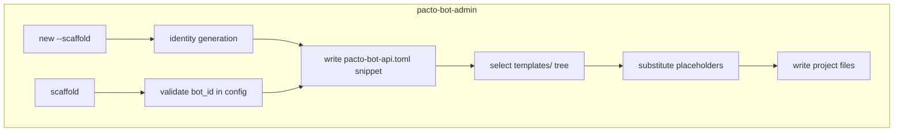

## Summary

Add a Rust-native scaffold feature to `pacto-bot-admin` that generates a complete, operationally-ready Python bot project from a per-language template directory. Two entry points share one generator: `new --scaffold` creates a bot identity and scaffolds the project; `scaffold` scaffolds a project for an existing identity. The generated project includes the handler file, `Dockerfile`, `docker-compose.yml`, systemd unit, `pacto-bot-api.toml`, `README.md`, and optional pytest files.

## Problem Frame

New bot developers currently copy and trim `examples/echo_bot.py` or `python/examples/greeting_bot.py`, then hand-write Docker, compose, systemd, and config files before they can run a bot. The repo has reference material but no opinionated starting point. This hand-assembly is friction before any bot logic is written.

## Requirements

### Entry points and identity handling

- R1. `pacto-bot-admin new --scaffold <bot-id>` creates a new bot identity and scaffolds a handler project in one run (see origin: R1).
- R2. `pacto-bot-admin scaffold <bot-id>` scaffolds a handler project using an existing bot identity from the daemon config; it fails fast if the identity does not exist (see origin: R2).
- R3. Both commands accept `--language <lang>` and default to `python` (see origin: R3).
- R4. `new --scaffold` generates pytest files by default and supports `--no-tests`; `scaffold` only generates tests when `--with-tests` is passed (see origin: R4).
- R5. Both commands accept `--commands <list>` to pre-seed slash-command stubs; interactive mode prompts for command names (see origin: R5).
- R6. `new --scaffold` writes the generated `[[bots]]` entry into the project’s `pacto-bot-api.toml` (see origin: R6).

### Generated project layout

- R7. The generated project root contains `pacto-bot-api.toml`, `docker-compose.yml`, `README.md`, and a systemd unit file for host-daemon development (see origin: R7).
- R8. In a single-bot project, the handler file and `Dockerfile` live at the project root (see origin: R8).
- R9. In a multi-bot project, each bot lives under `bots/<bot-id>/` with its handler file and `Dockerfile`; the root compose file targets any subset of `bots/*` (see origin: R9).
- R10. The generated `README.md` explains how to run the bot against a host daemon and how to run the full compose stack (see origin: R10).
- R11. The generated `pacto-bot-api.toml` references the scaffolded bot identity with the relays and capabilities collected during the command (see origin: R11).

### Docker and operational files

- R12. The generated `Dockerfile` builds a container image for the bot handler using the published Python SDK (see origin: R12).
- R13. The generated `docker-compose.yml` supports at least two profiles: `bot-only` (bot talking to a daemon on the host) and `full` (bot, daemon, and bunker) (see origin: R13).
- R14. The generated systemd unit runs the bot handler against a daemon on the host, using the same transport defaults as the SDK (see origin: R14).
- R15. Kubernetes manifests are not generated (see origin: R15).

### Generated handler code

- R16. The generated bot uses the published SDK (`from pacto_bot_api import Bot`) and the high-level `@bot.command("/name")` decorator API (see origin: R16).
- R17. Each command supplied via `--commands` or interactive prompt becomes a stub handler that returns a placeholder reply (see origin: R17).
- R18. The generated bot includes a `@bot.default` handler that ignores unrecognized commands (see origin: R18).
- R19. The generated bot accepts the standard SDK CLI flags through `bot.run()` (see origin: R19).

### Tests and safety

- R20. When tests are generated, the CLI emits pytest files that exercise each stub command and the default handler without requiring a live daemon (see origin: R20).
- R21. Re-running the scaffold command with tests on an existing project adds the test files without overwriting the bot handler, Dockerfile, or config (see origin: R21).
- R22. Before overwriting any existing file, the CLI prompts for permission unless `--force` is passed (see origin: R22).
- R23. The CLI refuses to overwrite signing material or a populated `pacto-bot-api.toml` with `--force`; these files must be renamed or removed by the operator (see origin: R23).
- R24. The generated `pacto-bot-api.toml` is created with `0o600` permissions or stricter (see origin: R24).
- R25. The CLI never writes real `nsec` values into generated handler code, README examples, or test fixtures (see origin: R25).

## Key Technical Decisions

- **Template-directory driven generation.** Per-language templates live in a `templates/<lang>/` directory. The CLI copies the tree, substitutes placeholders, and applies overwrite rules. This keeps templates readable and makes adding languages mechanical (origin: Key Decisions).
- **`{{key}}` substitution with optional `` conditionals.** Templates use `{{bot_id}}`, `{{commands}}`, etc. Conditional blocks handle single-bot vs. multi-bot layouts and test opt-in without requiring separate template files for every combination. A lightweight internal engine is preferred over a heavy template crate for v1.
- **Compose-file appending for multi-bot projects.** When adding a second bot to an existing project, the CLI appends a new service to the root `docker-compose.yml` and appends a new `[[bots]]` entry to `pacto-bot-api.toml`, leaving hand-edits intact.
- **Existing `cmd_new` identity generation reused.** `new --scaffold` calls the same key-generation and snippet-building logic as the current `new` command, then writes the snippet to a file instead of printing it.
- **`scaffold` reads the daemon config to validate identity existence.** It loads `pacto-bot-api.toml` via `DaemonConfig::load` and fails if the requested `bot_id` is not present.

## High-Level Technical Design

The scaffold generator is a new module invoked from `src/admin.rs`. It takes a `ScaffoldRequest` struct (bot_id, language, commands, tests flag, project root) and performs these steps:

1. Resolve the project root (`<bot-id>/` for `new --scaffold`, current directory for `scaffold` unless `--project-dir` is given).
2. For `new --scaffold`, generate keys and build the `[[bots]]` snippet, then write it to `pacto-bot-api.toml` with `0o600` permissions.
3. For `scaffold`, load the existing config and verify the `bot_id` exists.
4. Determine layout mode: single-bot if the project root is empty, multi-bot if `bots/` or `pacto-bot-api.toml` already exists.
5. Copy the selected template tree, substituting placeholders.
6. Apply overwrite rules: prompt by default, respect `--force`, never force-overwrite signing material or populated config.

## Implementation Units

### U1. Add CLI command structs and routing

- **Goal:** Wire `new --scaffold`, the new `scaffold` subcommand, and their flags into the existing clap structure.
- **Files:** `src/admin.rs`
- **Patterns:** Extend the `Command` enum with a `Scaffold` variant and add a `--scaffold` flag to `New`. Reuse the existing `--backend`, `--relays`, `--capabilities`, and `--uri` flags for `new --scaffold`. Add `--language`, `--commands`, `--with-tests`, `--no-tests`, `--force`, and `--project-dir` flags as needed.
- **Test scenarios:**
  - `pacto-bot-admin new --scaffold echo-bot` parses and runs.
  - `pacto-bot-admin scaffold echo-bot` fails when `echo-bot` is not in the config.
  - `pacto-bot-admin new --scaffold --no-tests echo-bot` skips test generation.
- **Verification:** Run `cargo test --test cli_args` or equivalent; add a new `tests/admin_cli_scaffold.rs`.

### U2. Create template directory structure

- **Goal:** Establish the template tree for Python and the substitution engine.
- **Files:** `templates/python/`, `src/scaffold/` or `src/scaffold.rs`
- **Patterns:** One directory per language containing `bot.py`, `Dockerfile`, `docker-compose.yml`, `systemd.service`, `README.md`, `pyproject.toml`, and `tests/test_bot.py`. Include a `manifest.toml` describing template metadata (language, version, files requiring overwrite protection).
- **Test scenarios:**
  - Templates parse and contain all required placeholders.
  - Substitution engine replaces `{{bot_id}}` and conditional blocks correctly.
- **Verification:** Unit tests in `src/scaffold/template.rs` or equivalent.

### U3. Implement project generation logic

- **Goal:** Generate the project files for single-bot and multi-bot layouts.
- **Files:** `src/scaffold/generate.rs` or equivalent, `templates/python/*`
- **Patterns:** Copy template files to the project root or `bots/<bot-id>/`; substitute bot-specific values; generate command stubs from the parsed `--commands` list; generate the `pacto-bot-api.toml` snippet for `new --scaffold`; append compose services and config entries for multi-bot retrofits.
- **Test scenarios:**
  - Single-bot layout matches AE1.
  - Multi-bot layout places files under `bots/<bot-id>/` and updates root compose/config.
  - Generated `README.md` and `Dockerfile` contain no real secrets.
- **Verification:** Golden-file tests in `tests/admin_cli_scaffold.rs` comparing generated output to snapshots.

### U4. Implement overwrite protection and safety guards

- **Goal:** Prevent accidental data loss and enforce permission/security rules.
- **Files:** `src/scaffold/safety.rs` or equivalent
- **Patterns:** Check file existence before writing; prompt via stdin unless `--force` or non-interactive; maintain a deny-list of files that never overwrite even with `--force` (`pacto-bot-api.toml` with existing `[[bots]]`, any file containing `nsec` material); set `0o600` on config files.
- **Test scenarios:**
  - Existing handler file triggers a prompt.
  - `--force` overwrites `README.md` but not `pacto-bot-api.toml`.
  - Generated config has restrictive permissions.
- **Verification:** Unit tests and integration tests in `tests/admin_cli_scaffold.rs`.

### U5. Add admin CLI tests for scaffold behavior

- **Goal:** Verify end-to-end scaffold behavior in temp directories.
- **Files:** `tests/admin_cli_scaffold.rs`
- **Patterns:** Use `assert_cmd`/`predicates` and `tempfile` to run the CLI, inspect generated files, and assert on permissions and content. Mirror patterns in `tests/admin_cli_creation.rs` and `tests/admin_cli_help.rs`.
- **Test scenarios:**
  - AE1, AE2, AE3, AE4 from the origin requirements doc.
  - Overwrite behavior and `--force` interactions.
  - Multi-bot append behavior.
- **Verification:** `cargo test --test admin_cli_scaffold` passes.

### U6. Update admin CLI help and operator docs

- **Goal:** Ensure `--help` and the LLM guide reflect the new commands.
- **Files:** `src/admin.rs` help text, `src/guide.rs`, `docs/pacto-bot-admin-llms.txt`
- **Patterns:** Add after-help examples for `new --scaffold` and `scaffold`. Regenerate `docs/pacto-bot-admin-llms.txt` via the existing xtask/CI flow.
- **Test scenarios:**
  - `pacto-bot-admin new --scaffold --help` shows examples and valid flags.
  - `pacto-bot-admin --llm-help` mentions scaffold workflows.
  - CI schema/doc sync passes.
- **Verification:** `cargo test --test admin_cli_help` and `cargo test --test admin_cli_llms_txt_sync`.

## Scope Boundaries

### Deferred for later

- Kubernetes manifests and Helm charts.
- Languages other than Python; the CLI still requires `--language` so the template engine can grow.
- WASM runtime handler support.
- Contract-test manifest generation like `examples/greeting_bot.manifest.json`.
- Auto-registration of the handler with a running daemon.
- Auto-publishing of the bot profile via `pacto-bot-admin publish-profile`.

### Outside this product's identity

- Changes to daemon runtime, JSON-RPC protocol, or identity-management behavior beyond writing config.

## Risks & Dependencies

- **Published Python SDK drift.** The generated `pyproject.toml` and `Dockerfile` pin the SDK dependency; if the SDK API changes, scaffolded bots break. Mitigation: add a CI test that scaffolds a bot and imports it against the current SDK.
- **Template maintenance burden.** Every new language or deployment target adds template files. Mitigation: keep templates small, conditional, and versioned via a `manifest.toml` per language.
- **Multi-bot compose appending correctness.** Appending services to an existing compose file risks duplicate names or YAML corruption. Mitigation: parse existing compose YAML and merge service maps rather than naive string append.
- **Secret leakage in generated output.** Stubs, READMEs, or test fixtures must never contain real `nsec` values. Mitigation: static scan tests and a deny-list of placeholder patterns.

## Acceptance Examples

- AE1. Covers R1, R7, R16, R17.
  - **Given:** A user runs `pacto-bot-admin new --scaffold echo-bot --backend nsec --relays ws://localhost:7000 --commands echo`.
  - **Then:** A directory `echo-bot/` is created containing `pacto-bot-api.toml` (mode `0o600`), `echo_bot.py` with `@bot.command("/echo")`, `Dockerfile`, `docker-compose.yml`, `README.md`, and a systemd unit. The config contains a generated `[[bots]]` entry for `echo-bot`.

- AE2. Covers R2, R22, R23.
  - **Given:** A user runs `pacto-bot-admin scaffold existing-bot` and `bots/existing-bot/` already exists.
  - **Then:** The CLI prompts before overwriting and refuses to overwrite `pacto-bot-api.toml` even if `--force` is passed.

- AE3. Covers R20, R21.
  - **Given:** A user runs `pacto-bot-admin scaffold echo-bot --with-tests` in a project where `echo_bot.py` already exists but no tests exist.
  - **Then:** The CLI adds test files without modifying `echo_bot.py`.

- AE4. Covers R13.
  - **Given:** A user runs `docker compose --profile full up --build` in a freshly scaffolded project.
  - **Then:** Containers for the bot, daemon, and bunker start and the bot connects to the daemon.

## Sources / Research

- `src/admin.rs` — current `pacto-bot-admin new` implementation (`cmd_new`, `run_interactive_new`, `build_bot_snippet`) and clap command structure.
- `src/config.rs` — `DaemonConfig`, `BotConfig`, and `SigningConfig` shapes.
- `python/src/pacto_bot_api/bot.py` — high-level `Bot` API used by generated handlers.
- `python/README.md` — SDK quickstart and CLI flag defaults.
- `docs/brainstorms/2026-06-30-bot-scaffold-requirements.md` — origin requirements document.
